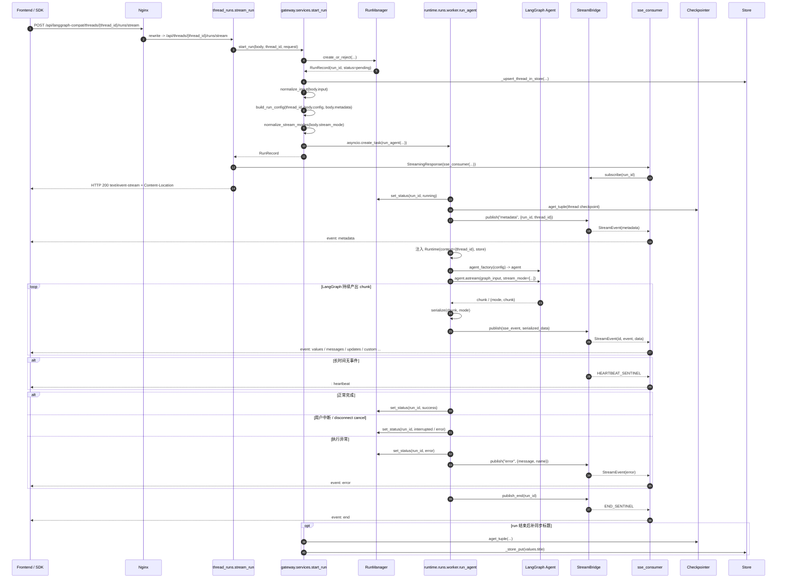
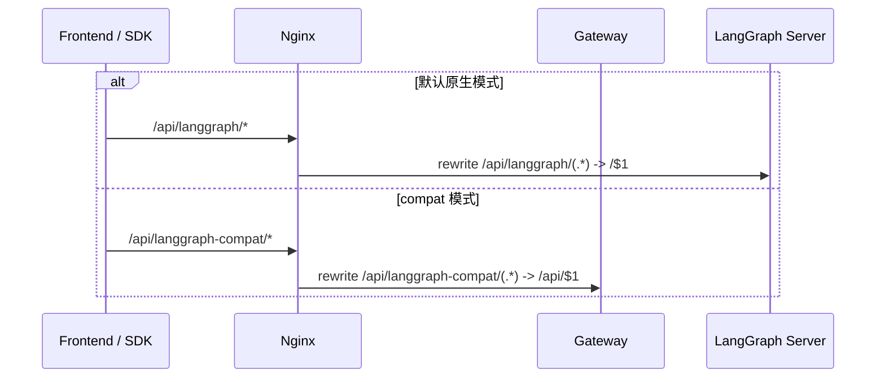
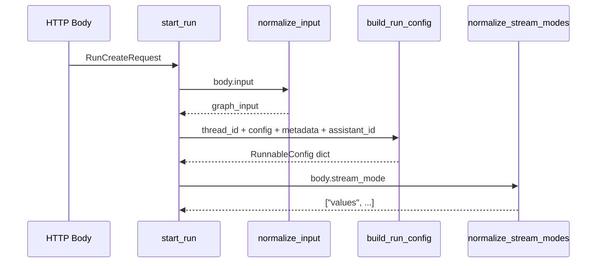
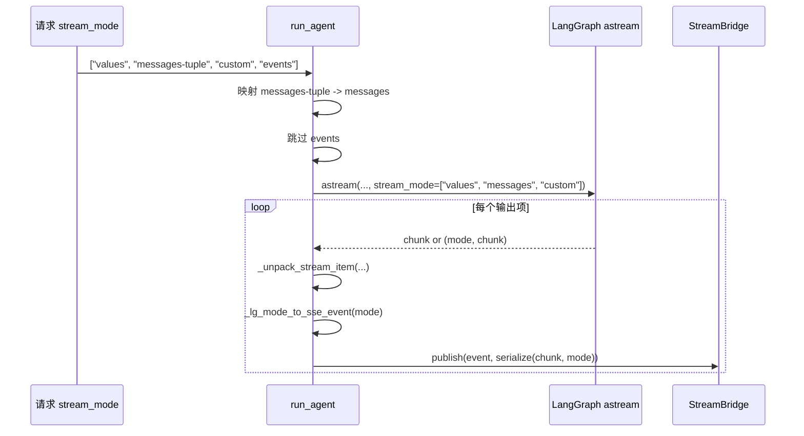
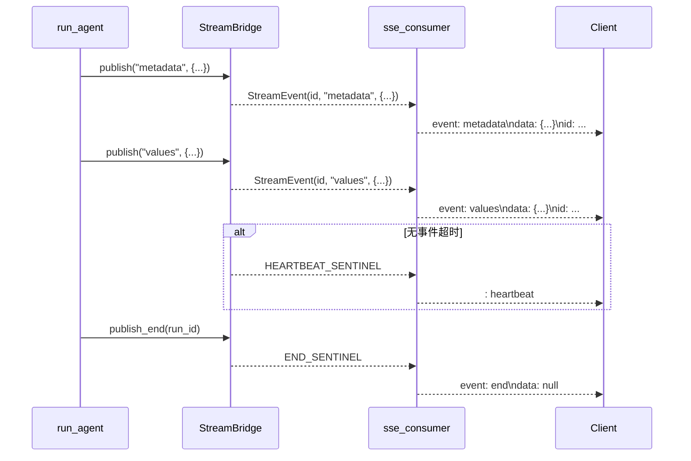
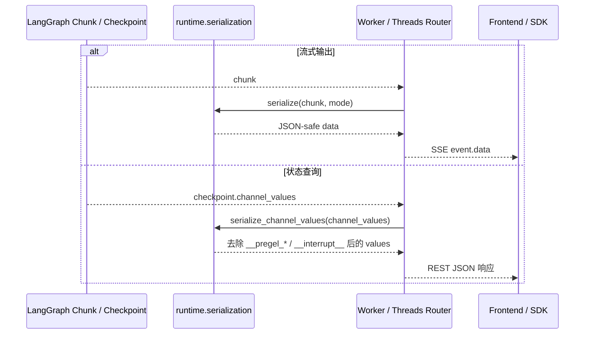
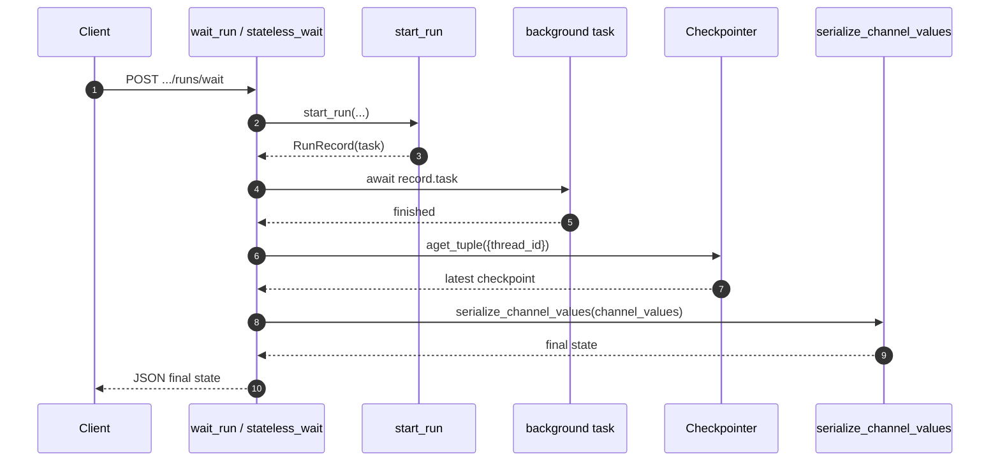
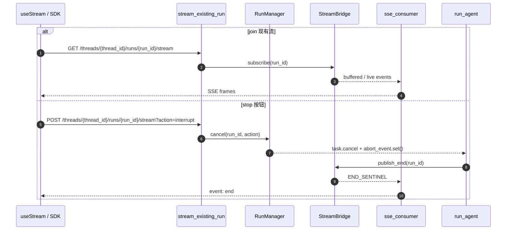
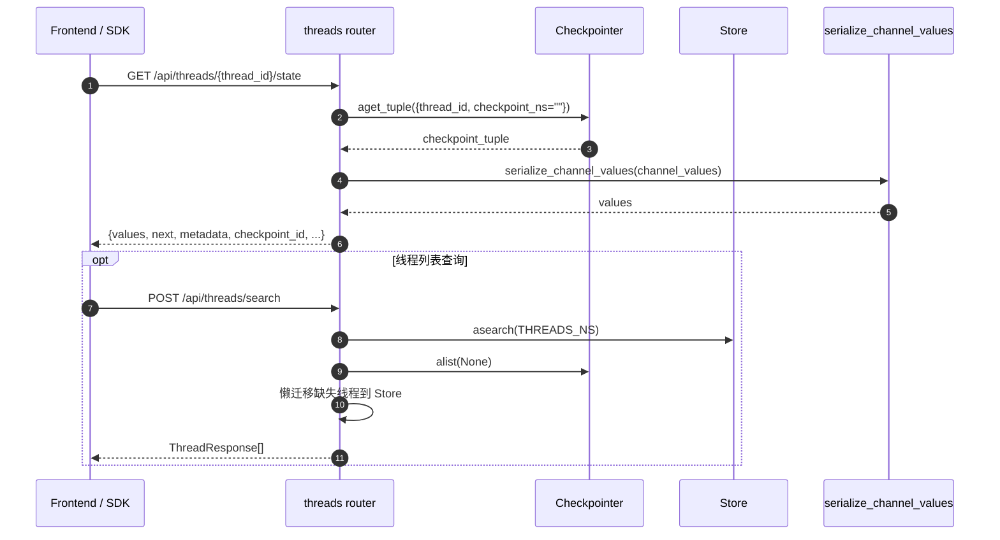
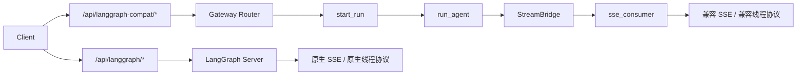

# SSE / 协议转换时序图

本文补充说明 DeerFlow 中与 SSE、LangGraph 协议兼容、运行时序列化相关的完整时序链路，重点覆盖：

- Gateway 兼容链路 `/api/langgraph-compat/* -> /api/*`
- Runtime 兼容层如何把 LangGraph 流事件转成 SSE
- 线程状态 / 历史接口如何复用同一套序列化逻辑
- 与原生 `/api/langgraph/*` 链路的职责对照

## 1. 先看全局定位

系统里实际存在两条“对外表现为 LangGraph 风格”的执行面：

- 原生链路：`/api/langgraph/*`
  - 由 Nginx 转发到 LangGraph Server
  - 核心运行、流式输出都由 LangGraph 原生服务负责
- 兼容链路：`/api/langgraph-compat/*`
  - 由 Nginx rewrite 到 Gateway 的 `/api/*`
  - 由 Gateway + `deerflow.runtime` 复刻 LangGraph Platform 风格协议

可以把兼容链路理解为：**在 Gateway 内部，把 HTTP 请求协议、LangGraph 执行协议、SSE 输出协议拼接起来的一层适配器。**

---

## 2. 总体时序图：兼容流式运行

这是最核心的一条链路，对应：

- 前端 `useStream`
- SDK `runs.stream`
- Gateway `POST /api/threads/{thread_id}/runs/stream`

## 3. 分阶段拆解：每一步在做什么

### 3.1 请求进入 Gateway 前

这里的关键点不是业务逻辑，而是“先决定由谁来负责协议兼容”：

- 原生模式：LangGraph Server 自己负责协议、状态和 SSE
- compat 模式：Gateway 接管 LangGraph 风格接口，再交给 DeerFlow runtime 执行

### 3.2 Gateway 服务层的输入协议转换

这一步做了三类协议对齐：

- 把 HTTP JSON `input.messages` 转成 LangChain 消息对象
- 把 LangGraph 请求参数整理成 `RunnableConfig`
- 把外部 `stream_mode` 归一化成 runtime 易处理的列表结构

### 3.3 Worker 对 LangGraph 流的模式转换

这里有两个最关键的兼容点：

- `messages-tuple` 不是 LangGraph `astream()` 的原生 mode 名称，兼容层会把它映射成 `messages`
- `events` 虽然可以被客户端请求，但当前 compat 层不会真正走 `astream_events()`，而是记录后跳过

### 3.4 StreamBridge 到 SSE 的最终落地

这一层是“内部事件对象 -> 文本化 SSE 帧”的最后一步：

- `StreamEvent` 中的 `event/data/id` 对应 SSE 的三段字段
- 心跳不是普通事件，而是 SSE 注释行
- `end` 事件固定以 `data: null` 结束

---

## 4. 序列化时序图：为什么 `serialization.py` 很关键

`serialization.py` 不负责网络传输，但它负责把 LangChain / LangGraph 内部对象压平成 API 可返回结构。

可以把它理解成一个统一出口：

- 流式链路里，worker 发布前先序列化
- REST 链路里，threads / runs/wait 返回前先序列化

这样就避免了：

- 把 LangChain message 对象直接暴露给前端
- 把内部 `__pregel_*` 字段暴露给客户端
- 不同接口返回结构不一致

---

## 5. 补充时序图：`wait` 型接口

除了流式接口，compat 层还支持同步等待式接口：

- `POST /api/threads/{thread_id}/runs/wait`
- `POST /api/runs/wait`

这条链路和流式模式的主要区别只有一个：

- 流式模式把运行中的 chunk 持续推给客户端
- wait 模式只在最后补读 checkpoint，返回最终状态快照

---

## 6. 补充时序图：join / cancel / stop 按钮

前端停止流式输出或重新加入已有流时，会用到已有 run 的 stream 端点。

这里的关键点是：

- compat 层不是直接“断开 HTTP”来表示停止
- 它会先更新 run 状态，再让 worker 收尾，最后仍然发送 `end`
- 这样前端看到的是一个完整结束的 LangGraph 风格流

---

## 7. 补充时序图：线程状态 / 历史接口为何也属于协议转换

严格说，协议转换不只发生在 SSE。

`/threads/{id}`、`/threads/{id}/state`、`/threads/{id}/history` 这些接口也在做：

- LangGraph checkpoint 数据结构
- 到对外 JSON 协议

之间的转换。

这一块的重点在于：

- `checkpoint` 是状态真相源
- `store` 是索引 / 投影层
- `serialize_channel_values()` 保证这两类接口对外暴露的 `values` 结构和流式事件保持一致风格

---

## 8. 原生链路与 compat 链路的职责对照

两者最终都向客户端暴露“看起来像 LangGraph”的接口，但内部职责不同：

- 原生链路：LangGraph Server 直接负责协议
- compat 链路：Gateway 和 DeerFlow runtime 自己完成协议拼装

---

## 9. 关键文件索引

### 9.1 路由与服务层

- `backend/app/gateway/routers/thread_runs.py`
- `backend/app/gateway/routers/runs.py`
- `backend/app/gateway/routers/threads.py`
- `backend/app/gateway/routers/assistants_compat.py`
- `backend/app/gateway/services.py`

### 9.2 Runtime 兼容层

- `backend/packages/harness/deerflow/runtime/runs/worker.py`
- `backend/packages/harness/deerflow/runtime/runs/manager.py`
- `backend/packages/harness/deerflow/runtime/stream_bridge/base.py`
- `backend/packages/harness/deerflow/runtime/stream_bridge/memory.py`
- `backend/packages/harness/deerflow/runtime/serialization.py`

### 9.3 前端 / 入口层

- `frontend/src/core/threads/hooks.ts`
- `frontend/src/core/api/api-client.ts`
- `frontend/src/core/api/stream-mode.ts`
- `docker/nginx/nginx.local.conf`

---

## 10. 一句话总结

DeerFlow 的 SSE / 协议转换核心不是单个函数，而是一条分层链路：

- Nginx 负责入口协议分流
- Gateway 负责请求参数兼容与 HTTP 协议外壳
- `run_agent` 负责把 LangGraph 执行流转成统一事件流
- `StreamBridge` 负责解耦生产与消费
- `sse_consumer` 负责落地成标准 SSE
- `serialization.py` 负责把内部对象压平成统一 JSON 协议

如果把整个 compat 链路看成一句话，就是：

**把 LangGraph 内部运行时，翻译成前端 / SDK 期望看到的 LangGraph Platform 风格外部协议。**
