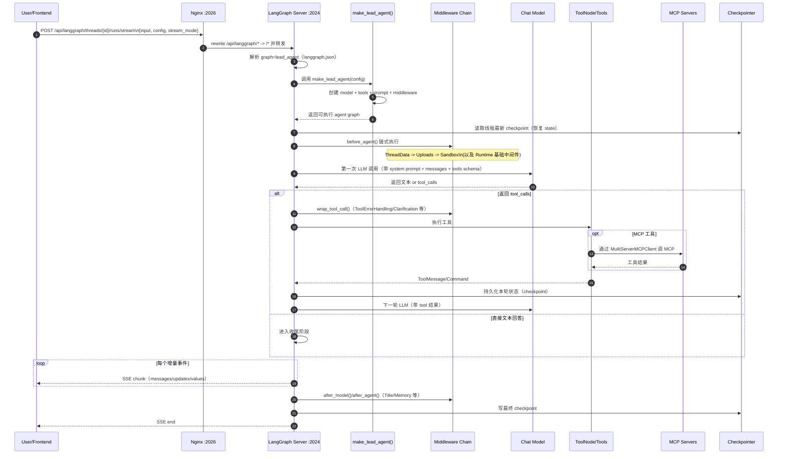
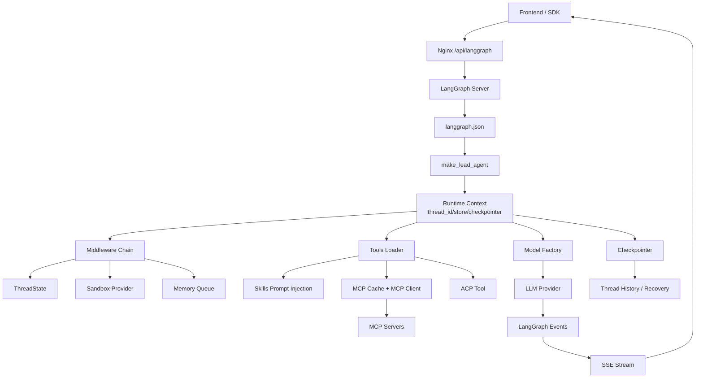

# DeerFlow Harness 架构详解

> 本文档详细介绍了 `packages/harness/deerflow/` 目录下各个Python文件的核心功能和关键函数。

## 🏗️ 核心架构模块

### 1. 代理系统 (`agents/`)

#### `lead_agent/agent.py` - 主代理工厂

**核心功能**：DeerFlow主代理的入口点，负责组装完整的代理实例

**关键函数**：

- **`make_lead_agent(config)`** - 主代理创建函数，从langgraph.json注册
  - 解析运行时配置（thinking_enabled、model_name、subagent_enabled）
  - 创建聊天模型（支持思考模式、推理强度）
  - 构建14个中间件的中间件链
  - 加载工具集（配置工具、MCP工具、子代理工具）
  - 生成系统提示词（注入技能、记忆、子代理说明）

- **`_build_middlewares()`** - 构建中间件链
  - 按固定顺序组装中间件：沙箱基础设施→错误处理→标题→记忆→子代理等
  - 支持运行时特性开关（plan_mode、subagent_enabled）
  - 支持自定义中间件注入

- **`_resolve_model_name()`** - 安全解析模型名称
  - 验证请求的模型是否存在
  - 无效时回退到默认模型
  - 记录警告日志

- **`_create_summarization_middleware()`** - 创建摘要中间件
  - 从配置读取触发条件和保留策略
  - 为摘要创建专用模型实例

- **`_create_todo_list_middleware()`** - 创建TodoList中间件
  - 仅在plan_mode启用时创建
  - 提供详细的系统提示词和工具描述

**文件路径**：`packages/harness/deerflow/agents/lead_agent/agent.py`

---

#### `factory.py` - 纯参数代理工厂

**核心功能**：SDK级别的代理创建入口，不依赖YAML配置文件

**关键函数**：

- **`create_deerflow_agent()`** - 从纯Python参数创建代理
  - 支持声明式特性开关（RuntimeFeatures）
  - 支持自定义中间件注入（@Next/@Prev定位）
  - 自动去重工具（用户工具优先）
  - 完全配置无关的工厂组装

- **`_assemble_from_features()`** - 从特性标志组装中间件链
  - 14个内置中间件的固定顺序
  - 处理extra_middleware的@Next/@Prev定位
  - 保证ClarificationMiddleware始终在最后
  - 特性值为False/True/实例三种处理方式

- **`_insert_extra()`** - 插入额外中间件
  - 验证@Next/@Prev定位
  - 检测冲突（两个中间件定位同一锚点）
  - 支持外部中间件间的交叉定位
  - 迭代式插入算法

**文件路径**：`packages/harness/deerflow/agents/factory.py`

---

#### `thread_state.py` - 线程状态定义

**核心功能**：定义LangGraph的状态schema

**关键组件**：

- **`ThreadState`** - 继承AgentState，扩展字段：
  - `sandbox` - 沙箱ID（沙箱状态）
  - `thread_data` - 线程目录路径（工作区、上传、输出）
  - `title` - 会话标题
  - `artifacts` - 输出文件列表（自定义reducer去重）
  - `todos` - 任务列表（TodoMiddleware使用）
  - `uploaded_files` - 上传文件列表
  - `viewed_images` - 已查看图片字典（特殊合并策略）

- **`merge_artifacts()`** - 自定义reducer
  - 合并两个artifacts列表
  - 使用dict.fromkeys()去重
  - 保持插入顺序

- **`merge_viewed_images()`** - 特殊reducer
  - 合并图片字典
  - 特殊情况：空字典{}表示清空所有图片
  - 新值覆盖同键的旧值

**文件路径**：`packages/harness/deerflow/agents/thread_state.py`

---

#### `lead_agent/prompt.py` - 系统提示词生成

**核心功能**：生成动态系统提示词

**关键函数**：

- **`apply_prompt_template()`** - 应用完整提示词模板
  - 注入记忆上下文（<memory>标签）
  - 注入技能列表（<skill_system>标签）
  - 注入子代理系统提示（带动态并发限制）
  - 注入ACP代理配置
  - 注入自定义挂载目录
  - 添加当前日期

- **`_build_subagent_section()`** - 生成子代理系统提示
  - 动态并发限制（max_concurrent_subagents）
  - 分批执行策略（多批次工作流）
  - 可用子代理列表（general-purpose、bash）
  - 直接执行vs子代理的使用场景

- **`get_skills_prompt_section()`** - 生成技能系统提示
  - 列出所有启用的技能
  - 渐进式加载模式说明
  - 技能容器路径映射

- **`_get_memory_context()`** - 格式化记忆用于注入
  - 检查记忆和注入开关
  - 限制token数量
  - 处理异常情况

- **`get_deferred_tools_prompt_section()`** - 生成延迟工具提示
  - 仅列出工具名称
  - 配合tool_search使用

- **`_build_acp_section()`** - 构建ACP代理提示
  - ACP工作区路径说明
  - 文件复制和呈现工作流

**文件路径**：`packages/harness/deerflow/agents/lead_agent/prompt.py`

---

### 2. 沙箱系统 (`sandbox/`)

#### `sandbox.py` - 沙箱抽象接口

**核心功能**：定义沙箱环境的抽象接口

**关键方法**：

- **`execute_command(command)`** - 执行bash命令
  - 返回标准输出或错误输出

- **`read_file(path)`** - 读取文件内容
  - 返回文件内容字符串

- **`write_file(path, content, append)`** - 写入文件
  - append=False：创建或覆盖
  - append=True：追加内容

- **`list_dir(path, max_depth)`** - 列出目录
  - max_depth默认为2
  - 返回目录内容列表

- **`glob(path, pattern)`** - 模式匹配查找文件
  - 支持include_dirs参数
  - 支持max_results限制
  - 返回（匹配列表, 是否截断）

- **`grep(path, pattern)`** - 搜索文件内容
  - 支持glob过滤文件类型
  - 支持literal字面量搜索
  - 支持case_sensitive大小写敏感
  - 返回（匹配列表, 是否截断）

- **`update_file(path, content)`** - 更新二进制文件
  - content为bytes类型

**文件路径**：`packages/harness/deerflow/sandbox/sandbox.py`

---

#### `sandbox_provider.py` - 沙箱提供者抽象

**核心功能**：定义沙箱生命周期管理接口

**关键方法**：

- **`acquire(thread_id)`** - 获取沙箱环境
  - 返回沙箱ID
  - thread_id用于隔离

- **`get(sandbox_id)`** - 获取已有沙箱
  - 返回Sandbox实例或None

- **`release(sandbox_id)`** - 释放沙箱
  - 销毁沙箱环境

**关键函数**：

- **`get_sandbox_provider()`** - 获取单例沙箱提供者
  - 首次调用时从配置创建
  - 后续调用返回缓存实例
  - 使用resolve_class()动态加载

- **`reset_sandbox_provider()`** - 重置缓存
  - 清除单例但不调用shutdown
  - 可能导致活动沙箱孤立

- **`shutdown_sandbox_provider()`** - 安全关闭
  - 调用provider的shutdown()方法
  - 释放所有活动沙箱
  - 清除单例

- **`set_sandbox_provider(provider)`** - 设置自定义提供者
  - 用于测试和模拟

**文件路径**：`packages/harness/deerflow/sandbox/sandbox_provider.py`

---

#### `tools.py` - 沙箱工具实现

**核心功能**：实现沙箱相关的LangChain工具

**关键工具**：

- **`bash_tool`** - 执行bash命令
  - 虚拟路径转换（replace_virtual_paths_in_command）
  - 错误处理和异常转换
  - 返回命令输出

- **`ls_tool`** - 列出目录
  - 树形结构展示
  - 最大深度2层
  - 虚拟路径转换

- **`read_file_tool`** - 读取文件
  - 支持行范围参数（offset, limit）
  - 虚拟路径转换
  - 错误处理

- **`write_file_tool`** - 写入文件
  - 支持追加模式
  - 自动创建目录
  - 虚拟路径转换

- **`str_replace_tool`** - 字符串替换
  - 单次或全部替换（replace_all）
  - 同路径序列化锁（防止并发冲突）
  - 返回替换预览

**文件路径**：`packages/harness/deerflow/sandbox/tools.py`

---

#### `middleware.py` - 沙箱中间件

**核心功能**：管理代理的沙箱生命周期

**关键类**：

- **`SandboxMiddleware`** - 沙箱中间件
  - `before_model()` - 在模型调用前获取沙箱
    - 从thread_id获取或创建沙箱
    - 将sandbox_id存入state
  - 支持lazy_init模式（延迟初始化）

**文件路径**：`packages/harness/deerflow/sandbox/middleware.py`

---

### 3. 工具系统 (`tools/`)

#### `tools.py` - 工具加载器

**核心功能**：组装所有可用工具

**关键函数**：

- **`get_available_tools()`** - 获取工具列表
  - **配置定义的工具** - 从config.yaml的tools字段加载
  - **内置工具** - present_files、ask_clarification
  - **视觉工具** - view_image（仅当模型支持视觉时）
  - **子代理工具** - task（仅当subagent_enabled时）
  - **MCP工具** - 从MCP服务器加载（懒加载+缓存）
  - **社区工具** - tavily、jina_ai、firecrawl等
  - **ACP代理工具** - invoke_acp_agent

**工具过滤**：
- `groups` - 按工具组过滤
- `model_name` - 按模型能力过滤（vision）
- `_is_host_bash_tool()` - 安全过滤（host_bash）

**工具搜索集成**：
- 当tool_search启用时，MCP工具注册到延迟注册表
- 添加tool_search工具到内置工具

**文件路径**：`packages/harness/deerflow/tools/tools.py`

---

#### `builtins/task_tool.py` - 子代理工具

**核心功能**：实现task工具，用于委托子代理

**关键函数**：

- **`task(description, prompt, subagent_type, max_turns)`** - 创建子代理任务
  - 创建SubagentExecutor实例
  - 调用execute_async()启动后台执行
  - 轮询任务状态（5秒间隔）
  - 返回最终结果

**轮询逻辑**：
- 检查任务状态（PENDING → RUNNING → COMPLETED/FAILED/TIMED_OUT）
- 15分钟超时
- 返回结果+AI消息列表
- 完成后清理后台任务

**文件路径**：`packages/harness/deerflow/tools/builtins/task_tool.py`

---

#### `builtins/view_image_tool.py` - 图片查看工具

**核心功能**：读取图片并转换为base64

**关键函数**：

- **`view_image(image_path)`** - 查看图片
  - 虚拟路径转换
  - 读取文件字节
  - 转换为base64
  - 返回mime_type和base64数据

**使用场景**：
- 仅在模型支持视觉时添加到工具集
- ViewImageMiddleware自动注入图片数据到state

**文件路径**：`packages/harness/deerflow/tools/builtins/view_image_tool.py`

---

#### `builtins/present_file_tool.py` - 文件呈现工具

**核心功能**：使输出文件对用户可见

**关键函数**：

- **`present_file(path)`** - 呈现文件
  - 仅允许/mnt/user-data/outputs路径
  - 添加到artifacts列表
  - 返回确认消息

**安全限制**：
- 路径遍历检测
- 仅允许outputs目录

**文件路径**：`packages/harness/deerflow/tools/builtins/present_file_tool.py`

---

#### `builtins/tool_search.py` - 工具搜索

**核心功能**：延迟加载和搜索MCP工具

**关键类**：

- **`DeferredToolRegistry`** - 延迟工具注册表
  - `register()` - 注册延迟工具
  - `get()` - 按名称获取工具
  - `search()` - 搜索工具（名称/描述）

- **`tool_search`** - 工具搜索工具
  - 查询参数：query、limit
  - 返回匹配工具列表

**使用场景**：
- 当tool_search配置启用时激活
- 减少初始绑定的工具数量
- 按需加载MCP工具

**文件路径**：`packages/harness/deerflow/tools/builtins/tool_search.py`

---

### 4. 子代理系统 (`subagents/`)

#### `executor.py` - 子代理执行引擎

**核心功能**：管理子代理的异步执行

**关键类**：

- **`SubagentExecutor`** - 子代理执行器
  - `__init__()` - 初始化执行器
    - 过滤工具（allowlist/denylist）
    - 继承父代理的沙箱和线程数据
    - 生成trace_id用于分布式追踪

  - **`execute(task, result_holder)`** - 同步执行
    - 在新事件循环中运行异步执行
    - 支持异步工具（如MCP工具）
    - 返回SubagentResult

  - **`_aexecute(task, result_holder)`** - 异步执行
    - 创建代理实例
    - 构建初始状态
    - 使用stream获取实时更新
    - 收集AI消息列表
    - 处理内容提取（str/list）
    - 更新result_holder状态

  - **`execute_async(task, task_id)`** - 后台执行
    - 创建PENDING状态的result
    - 提交到scheduler_pool
    - 在execution_pool中执行（支持超时）
    - 更新任务状态（RUNNING → COMPLETED/FAILED/TIMED_OUT）

**全局状态**：
- `_background_tasks` - 存储后台任务结果
- `_background_tasks_lock` - 线程安全锁
- `_scheduler_pool` - 调度线程池（3 workers）
- `_execution_pool` - 执行线程池（3 workers）
- `MAX_CONCURRENT_SUBAGENTS = 3` - 硬并发限制

**关键函数**：

- **`get_background_task_result(task_id)`** - 获取后台任务结果
- **`list_background_tasks()`** - 列出所有后台任务
- **`cleanup_background_task(task_id)`** - 清理已完成任务
  - 仅清理终端状态（COMPLETED/FAILED/TIMED_OUT）
  - 避免与后台执行器的竞态条件

**文件路径**：`packages/harness/deerflow/subagents/executor.py`

---

#### `registry.py` - 子代理注册表

**核心功能**：管理可用子代理配置

**关键函数**：

- **`get_subagent_config(name)`** - 获取子代理配置
  - 从BUILTIN_SUBAGENTS查找
  - 应用config.yaml的超时覆盖
  - 返回SubagentConfig实例

- **`list_subagents()`** - 列出所有子代理
  - 返回所有SubagentConfig列表
  - 已应用config.yaml覆盖

- **`get_subagent_names()`** - 获取所有子代理名称
  - 返回名称列表

- **`get_available_subagent_names()`** - 获取当前可用的子代理
  - 检查host_bash是否允许
  - 不允许时排除bash子代理

**内置子代理**：
- `general-purpose` - 通用子代理（所有工具除了task）
- `bash` - 命令执行专家

**文件路径**：`packages/harness/deerflow/subagents/registry.py`

---

#### `config.py` - 子代理配置

**核心功能**：定义子代理配置数据结构

**关键类**：

- **`SubagentConfig`** - 子代理配置
  - `name` - 子代理名称
  - `system_prompt` - 系统提示词
  - `model` - 模型名称（"inherit"表示继承父代理）
  - `max_turns` - 最大轮数
  - `timeout_seconds` - 超时时间
  - `tools` - 允许的工具列表（allowlist）
  - `disallowed_tools` - 禁止的工具列表（denylist）

**文件路径**：`packages/harness/deerflow/subagents/config.py`

---

### 5. MCP系统 (`mcp/`)

#### `client.py` - MCP客户端构建

**核心功能**：构建langchain-mcp-adapters的服务器配置

**关键函数**：

- **`build_server_params(server_name, config)`** - 构建单个服务器参数
  - **stdio传输**：command + args + env
  - **SSE/HTTP传输**：url + headers
  - 验证必需字段
  - 返回服务器参数字典

- **`build_servers_config(extensions_config)`** - 构建所有服务器配置
  - 遍历启用的MCP服务器
  - 为每个服务器调用build_server_params()
  - 返回服务器名到参数的映射

**错误处理**：
- 缺少必需字段时抛出ValueError
- 记录配置失败的服务器

**文件路径**：`packages/harness/deerflow/mcp/client.py`

---

#### `cache.py` - MCP工具缓存

**核心功能**：缓存MCP工具，支持配置文件变更检测

**关键函数**：

- **`get_cached_mcp_tools()`** - 获取缓存的MCP工具
  - 首次调用时初始化MultiServerMCPClient
  - 后续调用返回缓存工具
  - 检测extensions_config.json的mtime变更
  - 自动失效并重新加载

**缓存失效**：
- mtime比较检测文件修改
- 重新加载ExtensionsConfig
- 重新创建MCP客户端

**文件路径**：`packages/harness/deerflow/mcp/cache.py`

---

#### `tools.py` - MCP工具加载

**核心功能**：从MCP客户端加载LangChain工具

**关键函数**：

- **`load_mcp_tools()`** - 加载MCP工具
  - 创建MultiServerMCPClient实例
  - 调用get_tools()获取工具列表
  - 转换为LangChain BaseTool格式

**懒加载**：
- 仅在首次使用时初始化
- 后续调用返回缓存结果

**文件路径**：`packages/harness/deerflow/mcp/tools.py`

---

### 6. 配置系统 (`config/`)

#### `app_config.py` - 应用配置

**核心功能**：加载和管理config.yaml

**关键类**：

- **`AppConfig`** - 主配置模型
  - `models` - 模型配置列表
  - `sandbox` - 沙箱配置
  - `tools` - 工具配置
  - `tool_groups` - 工具组配置
  - `skills` - 技能配置
  - `extensions` - 扩展配置（MCP和技能状态）
  - `tool_search` - 工具搜索配置
  - `title` - 标题生成配置
  - `summarization` - 摘要配置
  - `memory` - 记忆配置
  - `subagents` - 子代理配置
  - `guardrails` - 防护栏配置
  - `checkpointer` - 检查点配置
  - `stream_bridge` - 流桥配置
  - `token_usage` - Token使用追踪配置

**关键方法**：

- **`AppConfig.from_file(config_path)`** - 从YAML加载配置
  - 解析配置优先级（参数 > 环境变量 > 默认路径）
  - 检查配置版本
  - 解析环境变量（$VAR）
  - 加载各子配置模块
  - 合并extensions_config.json

- **`AppConfig.resolve_config_path(config_path)`** - 解析配置文件路径
  - 优先级：参数 > DEER_FLOW_CONFIG_PATH > 默认位置

- **`AppConfig.resolve_env_variables(config)`** - 递归解析环境变量
  - 识别$开头的值
  - 使用os.getenv()获取值
  - 递归处理dict和list

- **`AppConfig.get_model_config(name)`** - 按名称获取模型配置
- **`AppConfig.get_tool_config(name)`** - 按名称获取工具配置
- **`AppConfig.get_tool_group_config(name)`** - 按名称获取工具组配置

**全局函数**：

- **`get_app_config()`** - 获取单例配置
  - 返回缓存的配置实例
  - 检测文件变更（path和mtime）
  - 自动重载配置
  - 支持运行时覆盖

- **`reload_app_config(config_path)`** - 强制重载配置
  - 清除缓存
  - 从磁盘重新加载
  - 更新缓存元数据

- **`reset_app_config()`** - 重置缓存
  - 清除单例
  - 下次调用重新加载

- **`set_app_config(config)`** - 设置自定义配置
  - 用于测试和模拟

**文件路径**：`packages/harness/deerflow/config/app_config.py`

---

#### `model_config.py` - 模型配置

**核心功能**：定义模型配置数据结构

**关键类**：

- **`ModelConfig`** - 模型配置
  - `name` - 模型名称（唯一标识）
  - `display_name` - 显示名称
  - `description` - 描述
  - `use` - 模型类路径（用于反射加载）
  - `supports_thinking` - 是否支持思考模式
  - `supports_reasoning_effort` - 是否支持推理强度
  - `supports_vision` - 是否支持视觉
  - `when_thinking_enabled` - 思考模式时的参数覆盖
  - `thinking` - 思考模式参数的快捷方式

**文件路径**：`packages/harness/deerflow/config/model_config.py`

---

### 7. 模型工厂 (`models/`)

#### `factory.py` - 模型创建工厂

**核心功能**：根据配置创建聊天模型实例

**关键函数**：

- **`create_chat_model(name, thinking_enabled, **kwargs)`** - 创建聊天模型
  - 从配置获取ModelConfig
  - 使用resolve_class()动态加载模型类
  - 合并配置参数和kwargs
  - 处理思考模式参数覆盖
  - 处理推理强度参数
  - 附加tracing回调
  - 返回BaseChatModel实例

**思考模式处理**：
- 检查model_config.supports_thinking
- 合并when_thinking_enabled参数
- 处理thinking快捷字段
- 禁用思考模式时传递disabled信号

**推理强度处理**：
- 检查model_config.supports_reasoning_effort
- 从kwargs获取reasoning_effort参数
- Codex特殊处理（映射到reasoning_effort）

**视觉能力**：
- model_config.supports_vision标志
- 用于决定是否添加view_image_tool

**Tracing集成**：
- build_tracing_callbacks()获取回调列表
- 附加到model实例的callbacks

**文件路径**：`packages/harness/deerflow/models/factory.py`

---

### 8. 记忆系统 (`agents/memory/`)

#### `updater.py` - 记忆更新器

**核心功能**：使用LLM更新长期记忆

**关键类**：

- **`MemoryUpdater`** - 记忆更新器
  - **`update_memory(messages, thread_id, agent_name, correction_detected)`** - 更新记忆
    - 检查记忆开关
    - 格式化对话文本
    - 构建更新提示词（包含当前记忆）
    - 调用LLM生成更新
    - 解析JSON响应
    - 应用更新（去重、限制）
    - 清除上传文件提及
    - 原子保存

  - **`_apply_updates(current_memory, update_data, thread_id)`** - 应用LLM生成的更新
    - 更新user部分（workContext、personalContext、topOfMind）
    - 更新history部分（recentMonths、earlierContext、longTermBackground）
    - 删除指定facts
    - 添加新facts（去重、置信度过滤）
    - 强制执行max_facts限制

**关键函数**：

- **`get_memory_data(agent_name)`** - 获取记忆数据
- **`reload_memory_data(agent_name)`** - 重新加载记忆
- **`create_memory_fact(content, category, confidence, agent_name)`** - 创建事实
- **`delete_memory_fact(fact_id, agent_name)`** - 删除事实
- **`update_memory_fact(fact_id, content, category, confidence, agent_name)`** - 更新事实
- **`clear_memory_data(agent_name)`** - 清空记忆
- **`import_memory_data(memory_data, agent_name)`** - 导入记忆
- **`update_memory_from_conversation(messages, thread_id, agent_name, correction_detected)`** - 便捷函数

**数据结构**：

- **`user`** - 用户上下文
  - `workContext` - 工作背景
  - `personalContext` - 个人背景
  - `topOfMind` - 当前关注点

- **`history`** - 历史上下文
  - `recentMonths` - 最近几个月
  - `earlierContext` - 早期上下文
  - `longTermBackground` - 长期背景

- **`facts`** - 离散事实列表
  - `id` - 事实ID
  - `content` - 事实内容
  - `category` - 分类（preference/knowledge/context/behavior/goal）
  - `confidence` - 置信度（0-1）
  - `createdAt` - 创建时间
  - `source` - 来源（thread_id或"manual"）
  - `sourceError` - 可选的错误来源

**特殊处理**：

- **`_strip_upload_mentions_from_memory()`** - 清除上传文件提及
  - 使用正则表达式匹配上传相关句子
  - 从所有summary和facts中移除
  - 避免跨会话引用不存在的文件

- **`_extract_text(content)`** - 提取纯文本
  - 处理str和list两种内容类型
  - 正确拼接chunked内容
  - 避免JSON解析失败

**文件路径**：`packages/harness/deerflow/agents/memory/updater.py`

---

#### `storage.py` - 记忆存储

**核心功能**：记忆数据的持久化存储

**关键类**：

- **`FileMemoryStorage`** - 文件存储实现
  - `load(agent_name)` - 加载记忆数据
  - `save(data, agent_name)` - 保存记忆数据
  - `reload(agent_name)` - 重新加载记忆数据

**关键函数**：

- **`get_memory_storage()`** - 获取记忆存储实例
- **`create_empty_memory()`** - 创建空记忆数据结构

**文件路径**：`packages/harness/deerflow/agents/memory/storage.py`

---

#### `queue.py` - 记忆更新队列

**核心功能**：防抖动的记忆更新队列

**关键类**：

- **`MemoryUpdateQueue`** - 记忆更新队列
  - `enqueue(thread_id, messages, agent_name, correction_detected)` - 加入队列
  - `start()` - 启动后台处理线程
  - `stop()` - 停止后台处理线程
  - `_process_loop()` - 后台处理循环

**防抖动逻辑**：
- 每个线程独立去重
- 等待debounce_seconds（默认30秒）
- 批量处理更新

**文件路径**：`packages/harness/deerflow/agents/memory/queue.py`

---

### 9. 技能系统 (`skills/`)

#### `loader.py` - 技能加载器

**核心功能**：扫描和加载技能

**关键函数**：

- **`load_skills(skills_path, use_config, enabled_only)`** - 加载所有技能
  - 扫描public/custom目录
  - 查找SKILL.md文件
  - 解析YAML frontmatter
  - 读取enabled状态（从extensions_config.json）
  - 按名称排序
  - 可选过滤仅启用的技能

- **`get_skills_root_path()`** - 获取技能根目录
  - 返回deer-flow/skills路径

**技能目录结构**：
```
deer-flow/skills/
├── public/          # 公共技能（提交到git）
│   └── skill-name/
│       └── SKILL.md
└── custom/          # 自定义技能（gitignored）
    └── skill-name/
        └── SKILL.md
```

**SKILL.md格式**：
```yaml
---
name: skill-name
description: Skill description
license: MIT
category: category-name
allowed-tools: [tool1, tool2]
---

Skill content in markdown...
```

**文件路径**：`packages/harness/deerflow/skills/loader.py`

---

#### `parser.py` - 技能解析器

**核心功能**：解析SKILL.md文件

**关键函数**：

- **`parse_skill_file(file_path, category, relative_path)`** - 解析技能文件
  - 读取SKILL.md
  - 解析YAML frontmatter
  - 提取元数据（name、description、license、category）
  - 提取内容
  - 返回Skill实例

**文件路径**：`packages/harness/deerflow/skills/parser.py`

---

#### `installer.py` - 技能安装器

**核心功能**：从.skill档案安装技能

**关键函数**：

- **`install_skill_from_archive(archive_path)`** - 安装技能
  - 解压.skill ZIP文件
  - 验证SKILL.md存在
  - 解析技能元数据
  - 复制到custom目录
  - 更新extensions_config.json
  - 返回成功消息

**文件路径**：`packages/harness/deerflow/skills/installer.py`

---

### 10. 中间件系统 (`agents/middlewares/`)

#### 中间件执行顺序（14个）

1. **`ThreadDataMiddleware`** - 创建线程目录
   - 在模型调用前创建thread_id目录
   - 设置workspace、uploads、outputs路径
   - 支持lazy_init模式

2. **`UploadsMiddleware`** - 跟踪上传文件
   - 扫描uploads目录
   - 将新文件添加到state
   - 在提示词中列出

3. **`SandboxMiddleware`** - 获取沙箱
   - 获取或创建沙箱
   - 将sandbox_id存入state
   - 支持lazy_init模式

4. **`DanglingToolCallMiddleware`** - 修复缺失的工具消息
   - 检测没有响应的tool_calls
   - 注入占位符ToolMessages
   - 防止模型等待永不到来的响应

5. **`GuardrailMiddleware`** - 工具调用授权
   - 可选的预授权检查
   - 支持自定义Provider
   - 拒绝时返回错误ToolMessage

6. **`ToolErrorHandlingMiddleware`** - 工具异常处理
   - 捕获工具执行异常
   - 转换为ToolMessages
   - 防止异常中断流程

7. **`SummarizationMiddleware`** - 上下文摘要
   - 检测token/message/分数触发条件
   - 对旧消息进行摘要
   - 保留最近消息

8. **`TodoMiddleware`** - 任务跟踪
   - 提供write_todos工具
   - 仅在plan_mode时启用
   - 跟踪任务状态（pending/in_progress/completed）

9. **`TitleMiddleware`** - 自动生成标题
   - 在首次完整交流后生成
   - 标准化结构化消息内容
   - 使用标题模型生成

10. **`MemoryMiddleware`** - 队列记忆更新
    - 过滤消息（用户输入+最终AI响应）
    - 加入记忆更新队列
    - 异步处理（防抖动）

11. **`ViewImageMiddleware`** - 注入图片base64
    - 检测对话中的图片路径
    - 读取图片并转换为base64
    - 注入到state.viewed_images
    - 仅在模型支持视觉时启用

12. **`SubagentLimitMiddleware`** - 限制子代理并发
    - 截断多余的task tool调用
    - 强制执行MAX_CONCURRENT_SUBAGENTS
    - 仅在subagent_enabled时启用

13. **`LoopDetectionMiddleware`** - 检测循环
    - 检测重复的工具调用模式
    - 检测无进展的循环
    - 中断循环并返回错误

14. **`ClarificationMiddleware`** - 拦截澄清请求
    - 拦截ask_clarification工具调用
    - 通过Command(goto=END)中断执行
    - **必须始终是最后一个中间件**

**关键文件路径**：
- `packages/harness/deerflow/agents/middlewares/thread_data_middleware.py`
- `packages/harness/deerflow/agents/middlewares/uploads_middleware.py`
- `packages/harness/deerflow/agents/middlewares/sandbox_audit_middleware.py`
- `packages/harness/deerflow/agents/middlewares/dangling_tool_call_middleware.py`
- `packages/harness/deerflow/agents/middlewares/tool_error_handling_middleware.py`
- `packages/harness/deerflow/agents/middlewares/loop_detection_middleware.py`
- `packages/harness/deerflow/agents/middlewares/clarification_middleware.py`

---

### 11. 反射系统 (`reflection/`)

#### `resolvers.py` - 动态加载器

**核心功能**：支持配置驱动的动态类加载

**关键函数**：

- **`resolve_variable(path, expected_type)`** - 导入模块并返回变量
  - 格式：`module.path:variable_name`
  - 用于加载工具、提供者等

- **`resolve_class(path, base_class)`** - 导入并验证类
  - 确保类是base_class的子类
  - 用于加载模型、沙箱提供者等

**使用示例**：
```python
# 加载工具
tool_class = resolve_variable("deerflow.sandbox.tools:bash_tool", BaseTool)

# 加载模型类
model_class = resolve_class("langchain_openai:ChatOpenAI", BaseChatModel)

# 加载沙箱提供者
provider_class = resolve_class("deerflow.sandbox.local:LocalSandboxProvider", SandboxProvider)
```

**文件路径**：`packages/harness/deerflow/reflection/resolvers.py`

---

### 12. 嵌入式客户端 (`client.py`)

#### `DeerFlowClient` - 嵌入式Python客户端

**核心功能**：无需HTTP服务即可使用DeerFlow

**初始化参数**：
- `config_path` - 配置文件路径
- `checkpointer` - LangGraph检查点实例（多轮对话必需）
- `model_name` - 覆盖默认模型
- `thinking_enabled` - 启用思考模式
- `subagent_enabled` - 启用子代理
- `plan_mode` - 启用计划模式
- `agent_name` - 代理名称
- `available_skills` - 可用技能集合
- `middlewares` - 自定义中间件列表

**关键方法**：

- **`stream(message, thread_id, **kwargs)`** - 流式对话
  - 返回Generator[StreamEvent]
  - 事件类型：
    - `values` - 完整状态快照
    - `messages-tuple` - 单个消息更新
    - `end` - 流结束
  - 支持token使用追踪

- **`chat(message, thread_id, **kwargs)`** - 同步对话
  - 返回最后的AI文本
  - 便捷方法，内部调用stream()

- **`reset_agent()`** - 强制重新创建代理
  - 清除缓存的代理实例
  - 用于配置变更后刷新

**配置查询方法**（与Gateway API兼容）：

**模型管理**：
- `list_models()` - 列出所有模型
- `get_model(name)` - 获取特定模型

**技能管理**：
- `list_skills(enabled_only)` - 列出技能
- `get_skill(name)` - 获取特定技能
- `update_skill(name, enabled=True/False)` - 更新技能状态
- `install_skill(skill_path)` - 安装.skill档案

**MCP管理**：
- `get_mcp_config()` - 获取MCP配置
- `update_mcp_config(servers)` - 更新MCP配置

**记忆管理**：
- `get_memory()` - 获取记忆数据
- `reload_memory()` - 重新加载记忆
- `clear_memory()` - 清空记忆
- `create_memory_fact(content, category, confidence)` - 创建事实
- `delete_memory_fact(fact_id)` - 删除事实
- `update_memory_fact(fact_id, ...)` - 更新事实
- `get_memory_config()` - 获取记忆配置
- `get_memory_status()` - 获取记忆状态

**文件操作**：
- `upload_files(thread_id, files)` - 上传文件
- `list_uploads(thread_id)` - 列出上传文件
- `delete_upload(thread_id, filename)` - 删除上传文件
- `get_artifact(thread_id, path)` - 读取输出文件

**内部方法**：

- **`_ensure_agent(config)`** - 确保代理已创建
  - 比较配置键决定是否重新创建
  - 延迟创建代理

- **`_get_runnable_config(thread_id, **overrides)`** - 构建RunnableConfig
  - 合并默认值和覆盖值

- **`_serialize_message(msg)`** - 序列化消息为字典
  - 处理AIMessage、ToolMessage、HumanMessage、SystemMessage

- **`_extract_text(content)`** - 提取纯文本
  - 处理str和list内容类型
  - 智能拼接chunked内容

- **`_atomic_write_json(path, data)`** - 原子写入JSON
  - 使用临时文件+替换模式

**使用示例**：
```python
from deerflow.client import DeerFlowClient

# 创建客户端
client = DeerFlowClient(
    model_name="claude-sonnet-4-6",
    thinking_enabled=True,
    subagent_enabled=True
)

# 简单对话
response = client.chat("Hello!")
print(response)

# 流式对话
for event in client.stream("Analyze this code"):
    print(event.type, event.data)

# 配置查询
models = client.list_models()
skills = client.list_skills(enabled_only=True)
```

**文件路径**：`packages/harness/deerflow/client.py`

---

### 13. 运行时系统 (`runtime/`)

#### `runs/` - 运行管理

**核心功能**：管理LangGraph运行的生命周期

**关键类**：

- **`RunManager`** - 运行管理器
  - 创建运行
  - 获取运行状态
  - 取消运行
  - 列出活跃运行

**文件路径**：
- `packages/harness/deerflow/runtime/runs/manager.py`
- `packages/harness/deerflow/runtime/runs/schemas.py`

---

#### `store/` - 状态存储

**核心功能**：LangGraph状态持久化

**关键类**：

- **`AsyncPostgresCheckpointSaver`** - PostgreSQL检查点
- **`AsyncSQLiteCheckpointSaver`** - SQLite检查点

**文件路径**：
- `packages/harness/deerflow/runtime/store/async_provider.py`
- `packages/harness/deerflow/runtime/store/provider.py`

---

### 14. 防护栏系统 (`guardrails/`)

#### `provider.py` - 防护栏提供者接口

**核心功能**：定义工具调用授权的抽象接口

**关键类**：

- **`GuardrailProvider`** - 防护栏提供者抽象
  - `evaluate(tool_name, tool_args)` - 评估工具调用
  - 返回允许或拒绝决策

**内置实现**：

- **`AllowlistProvider`** - 白名单提供者
  - 仅允许白名单中的工具
  - 零依赖实现

**文件路径**：
- `packages/harness/deerflow/guardrails/provider.py`
- `packages/harness/deerflow/guardrails/builtin.py`
- `packages/harness/deerflow/guardrails/middleware.py`

---

### 15. 社区工具 (`community/`)

#### 可用的社区工具

- **`tavily/`** - 网络搜索（5个结果默认）
- **`jina_ai/`** - 网络抓取（Jina Reader API）
- **`firecrawl/`** - 网络爬取（Firecrawl API）
- **`image_search/`** - 图片搜索（DuckDuckGo）
- **`aio_sandbox/`** - Docker沙箱隔离

**文件路径**：`packages/harness/deerflow/community/`

---

## 🎯 设计亮点

### 1. 清晰的依赖方向
- **harness → app** 单向依赖
- 通过 `test_harness_boundary.py` 强制执行
- harness可独立发布为 `deerflow-harness` 包

### 2. 配置驱动
- 所有组件通过 `config.yaml` 配置
- 支持环境变量引用（`$VAR`）
- 运行时热更新（mtime检测）
- 配置版本检查（`config_version`）

### 3. 中间件链架构
- 14个中间件有序执行
- 职责单一，易于扩展
- 支持 `@Next`/`@Prev` 定位
- ClarificationMiddleware 始终最后

### 4. 线程隔离
- 每个线程独立目录
- 每个线程独立沙箱
- 虚拟路径系统（`/mnt/user-data/`）
- 支持自定义挂载

### 5. 懒加载+缓存
- MCP工具懒初始化
- mtime检测自动失效
- 记忆数据防抖动队列
- 代理实例缓存（配置键比较）

### 6. 双线程池
- `_scheduler_pool` - 调度线程池（3 workers）
- `_execution_pool` - 执行线程池（3 workers）
- 支持超时控制（15分钟）
- 硬并发限制（MAX_CONCURRENT_SUBAGENTS = 3）

### 7. SDK级别工厂
- `create_deerflow_agent()` - 纯参数创建
- 不依赖YAML文件
- 支持声明式特性
- 完全可测试

### 8. 嵌入式客户端
- 无需HTTP服务
- 与Gateway API兼容的返回格式
- 支持流式和同步对话
- 完整的配置查询接口

### 9. 动态提示词
- 记忆上下文注入
- 技能列表注入
- 子代理系统提示
- ACP代理配置
- 自定义挂载说明

### 10. 类型安全
- Pydantic模型验证
- 类型提示覆盖
- Strict类型检查
- 配置版本控制

---

## 📦 模块依赖图

```
client.py
    ├── agents/lead_agent/agent.py (make_lead_agent)
    │   ├── models/factory.py (create_chat_model)
    │   ├── tools/tools.py (get_available_tools)
    │   │   ├── config/app_config.py
    │   │   ├── mcp/cache.py
    │   │   └── subagents/registry.py
    │   └── agents/lead_agent/prompt.py (apply_prompt_template)
    │       ├── skills/loader.py
    │       ├── agents/memory/updater.py
    │       └── subagents/registry.py
    └── config/app_config.py

tools/tools.py
    ├── config/app_config.py
    ├── reflection/resolvers.py
    ├── mcp/cache.py
    │   └── config/extensions_config.py
    └── subagents/registry.py

subagents/executor.py
    ├── models/factory.py
    └── agents/factory.py (create_deerflow_agent)
```

---

## 🔧 关键配置文件

### `config.yaml`
- 模型配置（models）
- 工具配置（tools）
- 沙箱配置（sandbox）
- 技能配置（skills）
- 记忆配置（memory）
- 子代理配置（subagents）
- 防护栏配置（guardrails）
- 检查点配置（checkpointer）

### `extensions_config.json`
- MCP服务器配置（mcpServers）
- 技能状态（skills）

### `langgraph.json`
- 图定义
- 节点配置
- 边配置
- 中间件配置

---

## Backend 启动过程（代码实链）

### 启动入口
1. 项目根目录执行 `make dev` / `make start`。
2. Makefile 调用 `scripts/serve.sh`（`--dev` 或 `--prod`）。
3. `serve.sh` 先完成环境与预检查：
   - 加载 `.env`
   - 清理旧进程（`langgraph dev` / `uvicorn` / `nginx`）
   - 检查 `config.yaml` 是否存在
   - 自动执行 `scripts/config-upgrade.sh`

### 进程启动顺序
1. **LangGraph Server（:2024）**
   - 命令：`uv run langgraph dev ... --port 2024`
   - 启动后等待 2024 端口就绪。
2. **Gateway API（:8001）**
   - 命令：`PYTHONPATH=. uv run uvicorn app.gateway.app:app --port 8001`
   - 启动后等待 8001 端口就绪。
3. **Frontend（:3000）**
   - DEV：`pnpm run dev`
   - PROD：`pnpm run preview`
4. **Nginx（:2026）**
   - 作为统一入口对外暴露：
     - `/api/langgraph/*` -> LangGraph Server
     - `/api/*` -> Gateway

### LangGraph Server 启动后行为
1. 读取 `backend/langgraph.json`。
2. 图入口绑定：`lead_agent -> deerflow.agents:make_lead_agent`。
3. Checkpointer 工厂绑定：`make_checkpointer`。
4. 请求到达 `/threads/*`、`/runs/*` 后，由 LangGraph 直接执行图与流式输出。

### Gateway 启动后行为（FastAPI lifespan）
1. 执行 `get_app_config()`，加载并校验配置。
2. 初始化 runtime 单例并注入 `app.state`：
   - `stream_bridge`
   - `checkpointer`
   - `store`
   - `run_manager`
3. 尝试启动 IM 渠道服务（channels）。
4. 注册各路由（models/mcp/memory/skills/threads/runs 等）。

### 对外访问与路由分发（Nginx）
1. 统一访问入口：`http://localhost:2026`。
2. `location /api/langgraph/`：rewrite 后代理到 `127.0.0.1:2024`。
3. `location /api/langgraph-compat/`：rewrite 后代理到 Gateway（`127.0.0.1:8001`）。
4. 其余页面请求代理到 Frontend（`127.0.0.1:3000`）。

### 关键文件定位
- `Makefile`（项目根）：`dev` / `start` / `dev-daemon` 入口
- `scripts/serve.sh`：本地多进程启动编排
- `docker/docker-compose*.yaml`：容器化启动编排
- `docker/nginx/nginx.local.conf`：2026 端口反向代理路由
- `backend/langgraph.json`：LangGraph 图入口与 checkpointer 配置
- `backend/app/gateway/app.py`：Gateway app 与 lifespan
- `backend/app/gateway/deps.py`：runtime 单例初始化与依赖注入

---

## /api/langgraph 接口执行时间线（逐轮）

### 典型请求：`POST /api/langgraph/threads/{thread_id}/runs/stream`



### 一轮请求内部执行顺序（backend 核心链路）
1. **路由层**
   - `/api/langgraph/*` 在 Nginx 转发到 LangGraph server，不经过 Gateway 业务路由。
2. **图入口解析**
   - `langgraph.json` 将 `lead_agent` 绑定到 `make_lead_agent`。
3. **Agent 构建**
   - 解析运行参数（`model_name`、`thinking_enabled`、`is_plan_mode`、`subagent_enabled`、`agent_name`）。
   - 组装 middlewares（runtime 基础 + lead 专属）。
   - 创建 model（`create_chat_model`）。
   - 加载 tools（内置 + 配置 + MCP + ACP）。
   - 生成 system prompt（skills/memory/deferred-tools/subagent 注入）。
4. **执行循环**
   - LLM -> tool_calls -> tool 执行 -> ToolMessage -> 回到 LLM，直到停止。
5. **状态持久化**
   - 通过 checkpointer 持久化状态，支持恢复与历史读取。
6. **流式输出**
   - LangGraph 事件转为 SSE 持续推送（`messages/updates/values`）。

### 关键分支行为
- **Clarification 分支**
  - `ask_clarification` 被中间件拦截后可直接中断并等待用户补充。
- **LLM 故障分支**
  - `LLMErrorHandlingMiddleware` 负责重试与降级提示，尽量避免会话中断。
- **Tool 异常分支**
  - `ToolErrorHandlingMiddleware` 将工具异常转换为 `ToolMessage`，避免整次 run 失败。
- **MCP 延迟加载分支**
  - 启用 `tool_search` 时，MCP 工具先以 deferred 形态暴露，按需再加载完整 schema。

---

## Runtime 逻辑详解（场景、上下游、与其他环节关系）

### Runtime 的两层语义
- **Runtime-A（LangGraph 原生 runtime）**
  - 服务主链路 `/api/langgraph/*`。
  - 负责 graph 运行上下文、状态推进、中间件钩子、工具调用与 checkpoint 持久化。
- **Runtime-B（`deerflow.runtime` 兼容层）**
  - 主要服务 Gateway 的 `/api/langgraph-compat/*` 与 `/api/*`。
  - 用 `RunManager + StreamBridge + run_agent` 复刻 LangGraph 风格运行时行为。

### 使用场景
1. **标准对话场景（默认前端路径）**
   - 请求进入 `/api/langgraph/*`，由 LangGraph Server 直接执行（不经过 Gateway 业务路由）。
2. **兼容 API 场景（实验/平替）**
   - 请求进入 `/api/langgraph-compat/*`，由 Gateway + `deerflow.runtime` 执行。
3. **配置热变更场景**
   - skill/mcp 配置由 Gateway 更新后，LangGraph 运行时通过按文件读取与缓存失效策略感知变化。

### Runtime 上下游关系图



### Runtime 主链路中的职责拆分
1. **接收与恢复**
   - 读取线程 checkpoint，恢复 state 后进入本轮执行。
2. **上下文注入**
   - 把 `thread_id` 等信息放入 runtime context，供中间件与工具读取。
3. **中间件编排**
   - 在 `before_agent` / `wrap_tool_call` / `after_model` / `after_agent` 钩子处理线程目录、上传文件、沙箱、容错、澄清、标题、记忆等。
4. **模型与工具协同循环**
   - LLM 产出 tool_calls -> Tool 执行 -> ToolMessage 回流 -> 下一轮 LLM。
5. **状态持久化与流式输出**
   - 关键节点持久化 checkpoint，并持续输出 SSE 事件给前端。

### Runtime 与中间件的关系
- Runtime 提供会话级上下文与状态容器；中间件消费这些上下文并写回增量状态。
- `ThreadDataMiddleware` 依赖 runtime/context 的 `thread_id` 建立目录映射。
- `SandboxMiddleware` 依赖 runtime/context 绑定线程沙箱生命周期。
- `MemoryMiddleware` 在 after 阶段读取 state 并投递到记忆队列。
- `ClarificationMiddleware` / `ToolErrorHandlingMiddleware` / `LLMErrorHandlingMiddleware` 负责控制流与容错，避免硬中断。

### Runtime 与 model 的关系
- Runtime 决定每轮调用模型时携带的消息、工具 schema 与配置参数。
- `create_chat_model` 根据运行参数与模型能力（thinking/reasoning）生成最终模型实例。
- 模型回调（tracing）在模型实例阶段挂载，但在 runtime 循环中生效。

### Runtime 与 skill 的关系
- skill 主要通过系统提示词参与 runtime，而不是独立执行进程。
- 运行前加载启用技能，并注入 `<available_skills>` 区块，指导模型按技能工作流行动。
- 该设计让 runtime 在不改变执行引擎的前提下，实现能力策略的“软编排”。

### Runtime 与 MCP 的关系
- MCP 工具在 runtime 的工具装配阶段并入可调用集合。
- 配置变更通过 mtime 检查触发缓存失效，避免长生命周期进程使用陈旧 MCP 配置。
- 启用 `tool_search` 时，MCP 工具先 deferred，只暴露名称，按需再加载完整 schema，降低上下文 token 压力。

### Runtime-B（兼容层）与 Runtime-A（原生层）的关系
- Runtime-B 不负责 `/api/langgraph/*` 主链路。
- Runtime-B 在 Gateway 侧通过 `run_agent` 手动注入 `Runtime(context/store)`，让中间件读取逻辑与 LangGraph 原生链路保持一致。
- 因此二者关系是：**A 是主执行面，B 是兼容执行面；B 在语义上尽量对齐 A。**

---

## Backend API 总表（定位 + 执行流程）

### API 面域划分

| API 面域 | 入口路径 | 服务进程 | 主要定位 |
|---|---|---|---|
| LangGraph 原生面 | `/api/langgraph/*` | LangGraph Server (:2024) | 对话主链路、线程状态、runs 与 SSE |
| Gateway 业务面 | `/api/*` | FastAPI Gateway (:8001) | 配置管理、文件管理、记忆、自定义 agent、兼容接口 |
| LangGraph 兼容面 | `/api/langgraph-compat/*` | Gateway（经 nginx rewrite） | 对前端/SDK 暴露 LangGraph 风格接口 |

### Gateway 路由总表（`/api/*`）

| Router | 关键路径 | 定位 | 核心执行逻辑 |
|---|---|---|---|
| models | `GET /api/models`、`GET /api/models/{name}` | 查询可用模型元数据 | 读取 `get_app_config()`，脱敏返回模型信息 |
| mcp | `GET/PUT /api/mcp/config` | MCP 服务配置管理 | 读写 `extensions_config.json`，供 LangGraph 侧热感知 |
| skills | `GET/PUT /api/skills*`、`POST /api/skills/install` | 技能查询/开关/安装 | 扫描 `skills/` + `extensions_config` 状态并持久化 |
| memory | `/api/memory*`、`/api/memory/facts*` | 记忆数据管理 | 调 memory updater 执行导入导出、事实 CRUD、状态查询 |
| uploads | `/api/threads/{id}/uploads*` | 上传文件管理 | 保存到线程 uploads 目录，必要时同步到 sandbox，并可转 md |
| artifacts | `GET /api/threads/{id}/artifacts/{path}` | 产物下载/预览 | 安全解析虚拟路径，按 MIME/安全策略返回内容 |
| threads | `/api/threads*` | 线程索引、状态与历史 | store + checkpointer 双源读写，支持 state/history |
| thread_runs | `/api/threads/{id}/runs*` | 线程级 run 生命周期 | `start_run` + `RunManager` + `StreamBridge` + SSE |
| runs | `/api/runs/stream`、`/api/runs/wait` | 无状态运行入口 | 无 thread_id 时自动建临时线程并复用 run 流程 |
| assistants_compat | `/api/assistants*` | SDK 初始化兼容 | 返回 lead_agent + custom agents 的最小 assistants 协议 |
| agents | `/api/agents*`、`/api/user-profile` | 自定义 agent 管理 | 管理 agent 目录、`config.yaml`、`SOUL.md`、`USER.md` |
| suggestions | `POST /api/threads/{id}/suggestions` | 追问建议生成 | 临时调用 chat model 生成 JSON 数组建议 |
| channels | `GET /api/channels/`、`POST /restart` | IM 渠道运维 | 查询 channel service 状态、重启指定通道 |

### 典型执行流程 A：`/api/langgraph/*`（主对话链路）
1. Nginx 将 `/api/langgraph/*` 转发到 LangGraph Server。
2. LangGraph 根据 `langgraph.json` 定位 `lead_agent -> make_lead_agent`。
3. Agent 构建阶段完成 model/tools/middleware/prompt 装配。
4. 执行循环：LLM -> tool_calls -> tool 执行 -> ToolMessage 回流。
5. checkpointer 持久化状态；SSE 事件持续推送到前端。

### 典型执行流程 B：`/api/threads/{thread_id}/runs/stream`（Gateway 兼容链路）
1. 路由层校验请求并进入 `start_run`。
2. 从 `app.state` 注入 `run_manager`、`stream_bridge`、`checkpointer`、`store`。
3. `RunManager.create_or_reject` 创建 run 并处理并发策略（reject/interrupt/rollback）。
4. 后台 task 执行 `run_agent`，内部创建 agent 并调用 `agent.astream(...)`。
5. 事件写入 `StreamBridge`；HTTP 层 `sse_consumer` 订阅并输出 SSE。
6. 结束后返回 `end` 事件，必要时读取 checkpoint 返回最终 state。

### 典型执行流程 C：配置类 API（以 `PUT /api/mcp/config` 为例）
1. 路由解析请求体并校验 schema。
2. 合并并写入 `extensions_config.json`。
3. `reload_extensions_config()` 更新 Gateway 进程缓存。
4. LangGraph 进程在后续工具装配时通过 mtime 检测触发 MCP 缓存失效并重载。

### API 面之间的依赖关系
- `/api/langgraph/*` 是执行主面；`/api/*` 负责“配置与资产管理面”。
- Gateway 对 skills/mcp 的写操作不会直接重启 LangGraph，而是通过文件与缓存失效机制让 LangGraph 渐进感知。
- `/api/langgraph-compat/*` 本质是 Gateway 对 LangGraph 协议的兼容实现，便于前端在单一后端进程下运行。

---

## `/api/langgraph` vs `/api/langgraph-compat` 对照与详解

### 实现位置
- **入口转发（Nginx）**
  - `/api/langgraph/*` -> `langgraph` upstream（2024）
  - `/api/langgraph-compat/*` -> rewrite 到 `/api/*` 并转发 `gateway` upstream（8001）
- **兼容实现代码（Gateway）**
  - 线程与状态：`app/gateway/routers/threads.py`
  - runs 生命周期：`app/gateway/routers/thread_runs.py`、`app/gateway/routers/runs.py`
  - assistants 兼容：`app/gateway/routers/assistants_compat.py`
  - 服务层：`app/gateway/services.py`（`start_run`、`sse_consumer`）
  - 运行时层：`packages/harness/deerflow/runtime/*`（`RunManager`、`StreamBridge`、`run_agent`）

### 对照表

| 维度 | `/api/langgraph/*` | `/api/langgraph-compat/*` |
|---|---|---|
| 服务进程 | LangGraph Server | Gateway |
| 路由来源 | Nginx 直接转发 | Nginx rewrite 到 `/api/*` |
| 执行引擎 | LangGraph 原生 API Server | Gateway + `deerflow.runtime` 兼容层 |
| 主要目标 | 官方主链路执行 | 在不依赖独立 LangGraph 服务时提供协议兼容 |
| 前端默认 | 默认使用 | 按需切换（例如 `NEXT_PUBLIC_LANGGRAPH_BASE_URL=/api/langgraph-compat`） |
| 典型用途 | 生产主路径/标准部署 | 开发调试、降级兜底、单进程后端场景 |

### 为什么需要 `/api/langgraph-compat`
- 前端与 SDK 期望使用 LangGraph 风格接口（threads/runs/stream/assistants）。
- 某些场景不希望额外运行独立 LangGraph 进程，或临时跳过 LangGraph 服务。
- 通过 Gateway 复刻协议与 SSE 语义，可在保留前端调用方式的同时完成运行。

### 解决的问题
1. **部署弹性**
   - 当 LangGraph 服务不可用或被跳过时，系统仍可通过 compat 提供会话能力。
2. **协议兼容**
   - 为前端 `useStream` 与 LangGraph SDK 提供对齐的 endpoint 与流式行为。
3. **统一运维面**
   - 配置管理、文件、记忆与兼容运行都在 Gateway 面可观测、可管理。

### 详细流程（`POST /api/langgraph-compat/threads/{thread_id}/runs/stream`）
1. **Nginx 重写**
   - `/api/langgraph-compat/threads/{id}/runs/stream`
   - rewrite 为 `/api/threads/{id}/runs/stream` 并转发 Gateway。
2. **Gateway 路由命中**
   - 命中 `thread_runs.stream_run`，准备 `StreamingResponse`。
3. **创建运行记录**
   - 调 `start_run`，从 `app.state` 取 `run_manager` / `stream_bridge` / `checkpointer` / `store`。
   - `RunManager.create_or_reject` 处理并发策略（`reject`/`interrupt`/`rollback`）。
4. **后台执行**
   - `asyncio.create_task(run_agent(...))` 启动后台任务。
   - `run_agent` 中手动注入 `Runtime(context={"thread_id": ...}, store=...)` 到运行配置，
     让中间件读取逻辑与原生链路尽量一致。
5. **流式桥接**
   - 后台把事件写入 `StreamBridge`。
   - HTTP 侧 `sse_consumer` 订阅 `StreamBridge` 并输出 SSE（heartbeat/end/断连处理）。
6. **收尾**
   - 更新 run 状态（`success`/`interrupted`/`error`），发布 `end`，清理缓存队列。
   - `wait` 类接口会补读 checkpoint 返回最终 channel values。

### 适用场景建议
- **优先使用** `/api/langgraph/*`：标准、原生、主路径。
- **按需切换** `/api/langgraph-compat/*`：
  - 本地开发需要简化运行面；
  - 临时绕过 LangGraph 服务故障；
  - 需要在 Gateway 内统一调试兼容运行链路。

---

## 当前系统的 Agent 架构与推理范式

### Agent 架构（当前实现）
- **单主代理 + 配置化角色变体**
  - 运行时主入口为 `lead_agent`，由 `make_lead_agent(config)` 动态构建。
  - 自定义 agent 通过 `agent_name`、`config.yaml`、`SOUL.md` 实现行为差异，本质复用同一执行图。
- **中间件驱动编排**
  - 核心能力由 middleware 链叠加（线程上下文、上传文件、沙箱、容错、标题、记忆、澄清、循环检测等）。
  - 中间件按有序链路执行，形成稳定的运行时控制流。
- **工具增强执行**
  - Agent 在构建阶段统一绑定模型与工具，工具来源包含内置工具、配置工具、MCP 工具、ACP 工具。
  - 通过工具调用实现外部系统交互与执行能力扩展。
- **线程状态持久化**
  - 以 thread 为隔离单元维护对话状态（messages/title/artifacts/todos/sandbox 等）。
  - 依赖 checkpointer 实现状态恢复、历史读取与中断续跑。

### 核心推理范式
- **Tool-Augmented ReAct 闭环**
  - 模型决策 -> 工具调用 -> 工具结果回流 -> 再次决策，迭代直至完成。
- **Clarify-then-Act（先澄清后执行）**
  - 遇到信息缺失/歧义/高风险操作，优先触发澄清流程，再进入执行。
  - `ask_clarification` 可被中间件拦截并中断流程，等待用户补充。
- **Plan / Decompose（可选）**
  - 启用 plan/subagent 模式后，采用任务分解、并行委派、批次执行、统一综合的编排式推理。
- **Guarded Reasoning（受约束推理）**
  - 通过 LLM 重试、工具异常降级、澄清中断等机制保证可恢复性与稳态执行。

### 系统提示词设计（Prompt Design）

#### 入口与装配位置
- 主提示词定义在 `packages/harness/deerflow/agents/lead_agent/prompt.py` 的 `SYSTEM_PROMPT_TEMPLATE`。
- 运行时由 `apply_prompt_template(...)` 按配置拼装最终提示词，并在 `make_lead_agent(...)` 中传入 `create_agent(...)`。
- 提示词不是固定文本，而是由模板 + 动态片段组合生成。

#### 分层结构
1. **主模板层（固定规则）**
   - 定义角色定位、工作方式、澄清策略、工作目录规范、引用规范、关键提醒。
2. **动态注入层（上下文与能力）**
   - 在模板中插入 `soul`、`skills_section`、`memory_context`、`deferred_tools_section`、`subagent_section`、ACP/挂载说明等片段。
3. **运行期开关层（配置驱动）**
   - 由 `configurable` 决定是否启用 plan/subagent、是否注入 deferred tools、是否显示 ACP 信息等。
4. **执行兜底层（中间件约束）**
   - 提示词声明策略，中间件负责强制执行与异常兜底，确保行为可控。

#### 关键设计点
- **Role + Soul 双层人格**
  - `Role` 提供系统级统一身份；
  - `Soul` 注入 agent 个性化风格，支持不同角色复用同一执行引擎。
- **澄清优先（Clarify-first）**
  - 将“信息不足先澄清”固化为主策略；
  - 与 `ClarificationMiddleware` 配合，实现可中断的询问流程。
- **路径与文件系统约束**
  - 明确 `/mnt/user-data/uploads`、`/mnt/user-data/workspace`、`/mnt/user-data/outputs` 三类目录职责，减少工具误操作与路径漂移。
- **引用与可追溯性约束**
  - 外部检索类回答要求包含 citation，保障结论可回溯。
- **上下文成本控制**
  - 当启用 `tool_search` 时，对 MCP 等工具使用 deferred 注入策略，只向模型暴露可检索入口，降低上下文膨胀。
- **可扩展增强**
  - 通过 Skills、Memory、Subagent、ACP 片段实现能力扩展，不破坏主模板稳定性。

#### 与其他模块的协同关系
- **与 Model**
  - 提示词定义决策策略与输出边界，模型负责语言与推理生成。
- **与 Middleware**
  - 提示词提出行为准则，中间件将其变成可执行控制逻辑。
- **与 Tools / MCP**
  - 提示词给出工具使用原则与检索机制，工具链提供真实执行能力。
- **与 Runtime**
  - Runtime 提供 thread 上下文与状态持久化，提示词围绕当前会话状态动态变化。

#### 设计目标总结
- **稳定性**：核心规则固化在模板层，避免会话漂移。
- **可配置性**：通过动态片段与配置开关实现多角色、多场景适配。
- **可治理性**：通过澄清、引用、目录规范等机制降低错误与风险。
- **可扩展性**：以片段注入模式接入 skills/memory/mcp/subagent，便于后续演进。

### 一句话总结
- 当前系统是一个以 **LangGraph 线程状态** 为底座、以 **middleware 链** 为骨架、以 **工具调用闭环** 为核心、以 **澄清优先** 为控制原则的单主代理架构。

---

## 相关文档

- [CLAUDE.md](../../../../../CLAUDE.md) - 项目总览
- [ARCHITECTURE.md](../../../../../docs/ARCHITECTURE.md) - 架构细节
- [API.md](../../../../../docs/API.md) - API参考
- [CONFIGURATION.md](../../../../../docs/CONFIGURATION.md) - 配置说明

---

*生成时间：2026-04-05*
*版本：DeerFlow 2.0*
