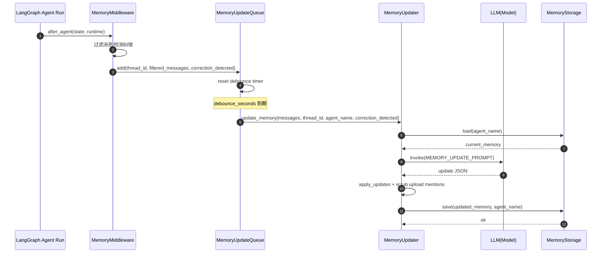
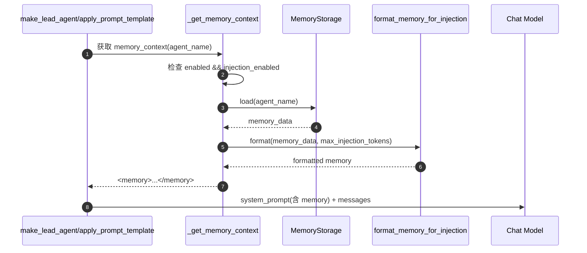
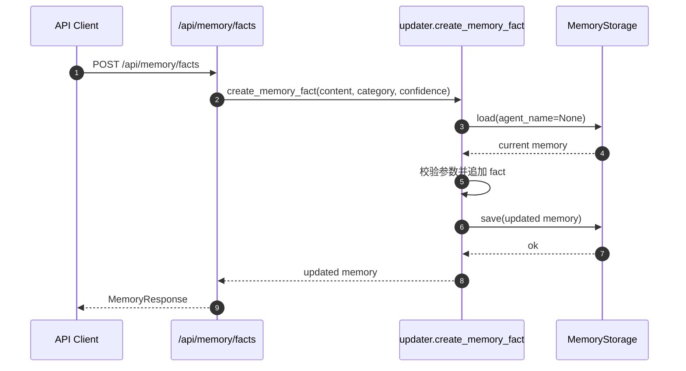

# Memory 设计总览

本文档整理 DeerFlow 当前 memory 子系统的完整设计，包括模块职责、核心数据结构、关键执行链路、配置治理与扩展点，并提供调用时序图。

## 1. 设计目标

- 在多轮会话中维护用户长期上下文（偏好、背景、目标、纠错经验）。
- 通过异步更新机制降低主对话链路延迟。
- 通过结构化记忆与阈值控制保证质量，避免噪声积累。
- 将可用记忆以 token 可控方式注入系统提示词，提升后续响应个性化与连续性。
- 提供可运维 API，支持人工审计、修正、导入导出。

## 2. 模块分层与职责

### 2.1 Middleware 采集层

- 文件：`agents/middlewares/memory_middleware.py`
- 类：`MemoryMiddleware`
- 职责：
  - 在 `after_agent` 阶段从当前 `state.messages` 提取可用于长期记忆的对话片段。
  - 过滤工具中间态与临时上传信息。
  - 检测“用户纠正”信号，作为后续高置信 correction fact 的提示。
  - 将结果投递到 `MemoryUpdateQueue`，不阻塞主对话返回。

### 2.2 Queue 调度层

- 文件：`agents/memory/queue.py`
- 类：`MemoryUpdateQueue`
- 职责：
  - 防抖（debounce）与削峰：多个短时间更新合并处理。
  - 线程级去重：同一 `thread_id` 仅保留最新上下文。
  - 异步批处理：定时触发后逐条调用 `MemoryUpdater`。
  - 提供 `flush/clear` 能力，便于测试与优雅停机。

### 2.3 Updater 更新层

- 文件：`agents/memory/updater.py`
- 类：`MemoryUpdater`
- 职责：
  - 读取当前记忆，构建 `MEMORY_UPDATE_PROMPT`。
  - 调用 LLM 生成结构化更新 JSON。
  - 应用更新规则（summary 更新、facts 增删、阈值过滤、上限裁剪、去重）。
  - 保存到存储层（默认文件），并做上传事件二次清洗。

### 2.4 Prompt 注入层

- 文件：`agents/memory/prompt.py`、`agents/lead_agent/prompt.py`
- 职责：
  - 将 memory 数据格式化为注入文本（`format_memory_for_injection`）。
  - 在 lead agent 系统提示词拼装时注入 `<memory>...</memory>` 段。
  - 按 token 预算优先注入高置信事实，控制上下文成本。

### 2.5 Storage 存储层

- 文件：`agents/memory/storage.py`
- 抽象：`MemoryStorage`
- 默认实现：`FileMemoryStorage`
- 职责：
  - 统一读写、缓存与 reload 语义。
  - 支持全局 memory 和 per-agent memory 两种命名空间。
  - 通过 `storage_class` 实现可替换存储后端。

### 2.6 Config 与 API 管理层

- 配置：`config/memory_config.py`，由 `AppConfig` 在加载配置时注入全局。
- API：`app/gateway/routers/memory.py` 提供读取、导入导出、事实 CRUD、状态查询。

## 3. 数据模型

`create_empty_memory()` 的目标结构：

- `version` / `lastUpdated`
- `user`
  - `workContext`
  - `personalContext`
  - `topOfMind`
- `history`
  - `recentMonths`
  - `earlierContext`
  - `longTermBackground`
- `facts[]`
  - `id`
  - `content`
  - `category`（preference/knowledge/context/behavior/goal/correction）
  - `confidence`
  - `createdAt`
  - `source`
  - `sourceError`（仅 correction 场景可选）

该结构同时支持：

- 可读摘要（sections）用于 prompt 注入。
- 可计算事实（facts）用于筛选、排序、去重、人工治理。

## 4. 配置设计

来源：`config.yaml` 的 `memory` 段（参考 `config.example.yaml`）。

关键字段：

- `enabled`：是否启用 memory 子系统。
- `storage_path`：记忆文件路径（可绝对路径或基于 base_dir 相对路径）。
- `storage_class`：存储实现类路径（可扩展）。
- `debounce_seconds`：队列防抖窗口。
- `model_name`：记忆更新专用模型，空则跟随默认模型解析。
- `max_facts`：facts 上限。
- `fact_confidence_threshold`：新增 fact 置信度阈值。
- `injection_enabled`：是否将 memory 注入系统提示词。
- `max_injection_tokens`：注入 token 上限。

## 5. 核心执行链路

### 5.1 写入链路（对话后异步更新）

1. 一轮 agent 完成后，`MemoryMiddleware.after_agent` 执行。
2. 提取 thread_id 与 messages，过滤中间态与上传标签。
3. 检测纠错信号（如“你理解错了”“try again”）。
4. `MemoryUpdateQueue.add()` 入队并重置防抖计时器。
5. 计时到期后 `_process_queue()` 批量处理：
   - 实例化 `MemoryUpdater`
   - 逐条执行 `update_memory(...)`
6. `MemoryUpdater`：
   - 加载当前 memory
   - 格式化 conversation
   - 调模型生成 update JSON
   - `_apply_updates` 合并
   - 清洗上传事件痕迹
   - `MemoryStorage.save(...)` 持久化

### 5.2 读取注入链路（下一轮请求）

1. lead agent 构建系统提示词时调用 `_get_memory_context(agent_name)`。
2. 检查 `enabled` 与 `injection_enabled`。
3. 从存储层加载 memory，`format_memory_for_injection(...)` 格式化。
4. 按 token 预算装配 `<memory>` 段，拼入最终系统提示词。
5. 模型在下一轮推理中使用这些长期记忆。

### 5.3 管理链路（API 运维）

1. Gateway 提供 `/api/memory*` 与 `/api/memory/facts*`。
2. 运维可直接查询、重载、清空、导出导入记忆，以及增删改事实。
3. API 最终都复用 updater/storage 能力，保证线上路径与管理路径一致。

## 6. 调用时序图

### 6.1 对话后异步更新时序

### 6.2 请求前记忆注入时序

### 6.3 管理 API 时序（以新增 fact 为例）

## 7. 关键质量控制策略

- 仅提取“用户输入 + 最终助手响应”，避免工具噪声污染长期记忆。
- 双重上传信息清洗（middleware 与 updater 各做一次），避免记住会话临时路径。
- 纠错信号显式强化，提升 correction 类事实沉淀质量。
- 事实置信度阈值与数量上限双重约束，避免低质事实膨胀。
- facts 按内容去重，减少重复事实。

## 8. 并发与一致性

- 队列使用线程锁与 `_processing` 标志，避免重入并发处理。
- 同一 thread 在队列中只保留最新 context，降低重复计算。
- 文件存储采用 temp file replace，尽量保证写入原子性。
- `FileMemoryStorage` 使用 mtime 缓存，兼顾性能与外部修改可见性（配合 reload）。

## 9. 扩展点

- 可替换存储：实现 `MemoryStorage` 并在 `storage_class` 指定类路径。
- 可替换更新模型：`memory.model_name` 指定专用模型。
- 可替换中间件：在 agent 工厂可关闭默认 memory 或注入自定义 `AgentMiddleware`。
- 可扩展事实策略：调整 prompt 与 `_apply_updates` 规则以适配业务知识图谱。

## 10. 已知边界

- 当前队列是进程内单例，跨进程/多实例部署需外部队列或集中式任务系统做统一调度。
- 更新链路依赖 LLM 返回 JSON，虽然有异常兜底，但在模型不稳定时会出现更新跳过。
- 目前事实去重以内容文本为主，语义近似重复仍可能存在。

## 11. 与其他子系统关系

- 与 `Prompt`：提供 `<memory>` 注入片段，影响下一轮决策。
- 与 `Middleware`：在 agent 完成后异步采集，避免阻塞主响应。
- 与 `Model`：通过独立更新调用沉淀长期记忆。
- 与 `Gateway API`：提供人工治理入口，纠偏自动更新结果。
- 与 `Agent`：支持 per-agent memory 命名空间，实现多角色记忆隔离。

