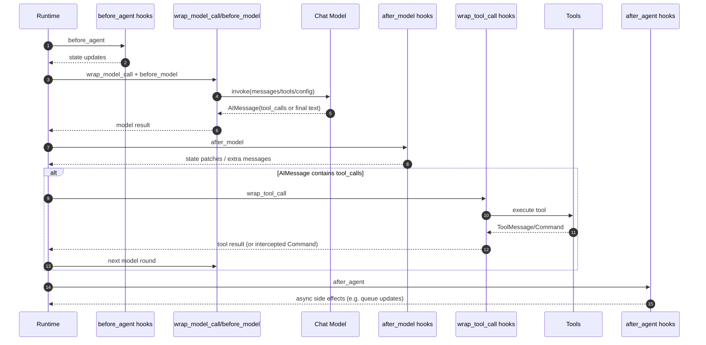

# Middlewares 设计与执行流程

本文档梳理 `deerflow/agents/middlewares` 目录下各 middleware 的功能定位、触发时机与核心实现流程，并补充与运行时链路的关系。

## 1. 总体设计

中间件体系以 Hook 驱动，按执行阶段介入：

- `before_agent`：Agent 开始执行前改写 state。
- `wrap_model_call`：包裹模型调用，修改请求或拦截异常。
- `before_model`：模型调用前注入额外上下文消息。
- `after_model`：模型调用后修正结果或追加状态。
- `wrap_tool_call`：包裹工具调用，审计、拦截、降级、控制流跳转。
- `after_agent`：整轮执行结束后做异步或收尾操作。

Lead Agent 的中间件顺序由两段构建：

1. 运行时基础链路：`build_lead_runtime_middlewares(...)`
2. Lead 专属链路：`_build_middlewares(...)`

## 2. Hook 维度调用时序

## 3. 各 Middleware 功能定位与实现流程

### 3.1 ThreadDataMiddleware

- 文件：`thread_data_middleware.py`
- Hook：`before_agent`
- 定位：为当前线程构建 `workspace/uploads/outputs` 路径并注入 `state.thread_data`。
- 核心流程：
  1. 从 `runtime.context.thread_id` 或 `configurable.thread_id` 获取线程 ID。
  2. `lazy_init=True` 时仅计算路径；`lazy_init=False` 时立即建目录。
  3. 返回 `{"thread_data": {...}}`。

### 3.2 UploadsMiddleware

- 文件：`uploads_middleware.py`
- Hook：`before_agent`
- 定位：将当前消息上传文件与历史上传文件注入 `<uploaded_files>` 上下文，增强“先读文件再回答”行为。
- 核心流程：
  1. 检测最后一条消息是否是 `HumanMessage`。
  2. 从 `additional_kwargs.files` 读取新上传文件。
  3. 从线程 uploads 目录扫描历史文件，并提取 Markdown outline/preview。
  4. 生成 `<uploaded_files>` 文本块，拼接到用户原始消息前。
  5. 回写 `messages` 与 `uploaded_files`。

### 3.3 DanglingToolCallMiddleware

- 文件：`dangling_tool_call_middleware.py`
- Hook：`wrap_model_call` / `awrap_model_call`
- 定位：修复历史消息中“有 tool_call 但缺 ToolMessage”的断链，避免模型输入格式非法。
- 核心流程：
  1. 收集所有已有 `ToolMessage.tool_call_id`。
  2. 扫描 AIMessage 的 `tool_calls`，找出缺失 ID。
  3. 在对应 AIMessage 后插入占位 `ToolMessage(status="error")`。
  4. 用 patched messages 继续模型调用。

### 3.4 LLMErrorHandlingMiddleware

- 文件：`llm_error_handling_middleware.py`
- Hook：`wrap_model_call` / `awrap_model_call`
- 定位：模型调用容错，重试瞬时错误并提供用户可读降级消息。
- 核心流程：
  1. 异常分类：`transient` / `busy` / `quota` / `auth` / `generic`。
  2. 对可重试错误执行指数退避（支持读取 `Retry-After`）。
  3. 超过重试上限后返回友好 `AIMessage`，不中断整轮运行。

### 3.5 SandboxAuditMiddleware

- 文件：`sandbox_audit_middleware.py`
- Hook：`wrap_tool_call` / `awrap_tool_call`
- 定位：对 `bash` 工具调用进行安全审计与风险分级。
- 核心流程：
  1. 对命令做 regex + `shlex` 分析，判定 `block/warn/pass`。
  2. 记录结构化审计日志（thread_id、command、verdict）。
  3. `block`：直接返回 error `ToolMessage`。
  4. `warn`：允许执行，并在工具结果附加风险提示。

### 3.6 ToolErrorHandlingMiddleware

- 文件：`tool_error_handling_middleware.py`
- Hook：`wrap_tool_call` / `awrap_tool_call`
- 定位：把工具执行异常转换成 error `ToolMessage`，保证 agent 可继续推理。
- 核心流程：
  1. 调用原工具 handler。
  2. 捕获普通异常并构建错误 ToolMessage（包含工具名、异常类型、错误摘要）。
  3. 保留 `GraphBubbleUp` 控制信号不吞掉。

### 3.7 TodoMiddleware

- 文件：`todo_middleware.py`
- Hook：`before_model` / `abefore_model`
- 定位：防止上下文截断后模型“忘记 todo 列表”。
- 核心流程：
  1. 若 state 中存在 `todos` 但当前消息窗口里无 `write_todos` 调用痕迹。
  2. 且尚未注入 `todo_reminder`。
  3. 注入一个 system_reminder 风格的 `HumanMessage(name="todo_reminder")`。

### 3.8 TokenUsageMiddleware

- 文件：`token_usage_middleware.py`
- Hook：`after_model` / `aafter_model`
- 定位：记录模型 token 消耗，用于观测与成本分析。
- 核心流程：
  1. 读取最后一条消息的 `usage_metadata`。
  2. 打日志输出 input/output/total tokens。

### 3.9 TitleMiddleware

- 文件：`title_middleware.py`
- Hook：`after_model` / `aafter_model`
- 定位：在首轮完整问答后自动生成线程标题。
- 核心流程：
  1. 检查是否开启、是否已有 title、是否满足“首轮交换”条件。
  2. 异步调用标题模型生成标题。
  3. 失败时使用用户首句截断作为 fallback。

### 3.10 MemoryMiddleware

- 文件：`memory_middleware.py`
- Hook：`after_agent`
- 定位：将可记忆对话异步投递到 memory queue，避免阻塞主链路。
- 核心流程：
  1. 校验 memory 开关和 thread_id。
  2. 过滤消息，仅保留用户输入与最终助手回复。
  3. 检测纠错信号。
  4. `get_memory_queue().add(...)` 入队。

### 3.11 ViewImageMiddleware

- 文件：`view_image_middleware.py`
- Hook：`before_model` / `abefore_model`
- 定位：在 `view_image` 工具完成后，将图片内容注入下一次模型调用上下文。
- 核心流程：
  1. 找到最近 AIMessage，确认包含 `view_image` tool call。
  2. 检查该轮所有 tool_call 是否都已有对应 ToolMessage。
  3. 从 `state.viewed_images` 生成 text + `image_url(base64)` 混合消息。
  4. 注入 `HumanMessage`，并避免重复注入。

### 3.12 DeferredToolFilterMiddleware

- 文件：`deferred_tool_filter_middleware.py`
- Hook：`wrap_model_call` / `awrap_model_call`
- 定位：开启 `tool_search` 时隐藏 deferred 工具 schema，减少模型上下文开销。
- 核心流程：
  1. 从 deferred registry 读取延迟工具名集合。
  2. 过滤 `request.tools`，保留 active 工具。
  3. 用过滤后的 tools 继续模型绑定与调用。

### 3.13 SubagentLimitMiddleware

- 文件：`subagent_limit_middleware.py`
- Hook：`after_model` / `aafter_model`
- 定位：限制单轮模型响应中的 `task` 工具并发调用数，防止过度并行。
- 核心流程：
  1. 统计最后 AIMessage 的 `task` tool_calls。
  2. 超过阈值则截断超出项。
  3. 回写替换 AIMessage（保留前 N 个 task 调用）。

### 3.14 LoopDetectionMiddleware

- 文件：`loop_detection_middleware.py`
- Hook：`after_model` / `aafter_model`
- 定位：检测重复工具调用死循环并强制收敛。
- 核心流程：
  1. 对 tool_calls（name+args）做稳定 hash。
  2. 线程级滑窗统计重复次数。
  3. 达 `warn_threshold`：注入提醒消息。
  4. 达 `hard_limit`：清空最后 AIMessage 的 tool_calls，迫使生成最终文本答案。

### 3.15 ClarificationMiddleware

- 文件：`clarification_middleware.py`
- Hook：`wrap_tool_call` / `awrap_tool_call`
- 定位：拦截 `ask_clarification`，转为“向用户提问并中断执行”的控制流。
- 核心流程：
  1. 识别工具名 `ask_clarification`。
  2. 格式化问题文本（含类型图标、上下文、选项）。
  3. 构造 `ToolMessage`。
  4. 返回 `Command(update={messages:[...]}, goto=END)`，等待用户补充后继续。

## 4. 与目录外中间件的关系

虽然不在 `agents/middlewares` 目录内，但执行链路中常一起工作：

- `SandboxMiddleware`：沙箱分配/释放（`deerflow/sandbox/middleware.py`）。
- `GuardrailMiddleware`：工具调用前策略评估（`deerflow/guardrails/middleware.py`，按配置启用）。

## 5. 顺序设计要点

- `ClarificationMiddleware` 必须在链路末尾，确保其他工具处理逻辑先执行，再由它做最终拦截中断。
- `ToolErrorHandlingMiddleware` 在 Clarification 之前，保证工具异常统一变成 ToolMessage。
- `MemoryMiddleware` 放在 Title 之后，避免丢失首轮标题信息。
- `ViewImageMiddleware` 在 Clarification 前，以便模型先看到图片细节再决定是否澄清。
- `DeferredToolFilterMiddleware` 只影响模型看到的 tools，不影响 ToolNode 实际可执行工具集。

## 6. 小结

该中间件体系采用“多阶段 Hook + 明确职责边界”的方式，把安全、容错、上下文增强、记忆更新、循环治理、澄清控制流等横切能力从 Agent 主逻辑中解耦。这样既能稳定主推理闭环，也便于按场景替换或扩展单个中间件。

