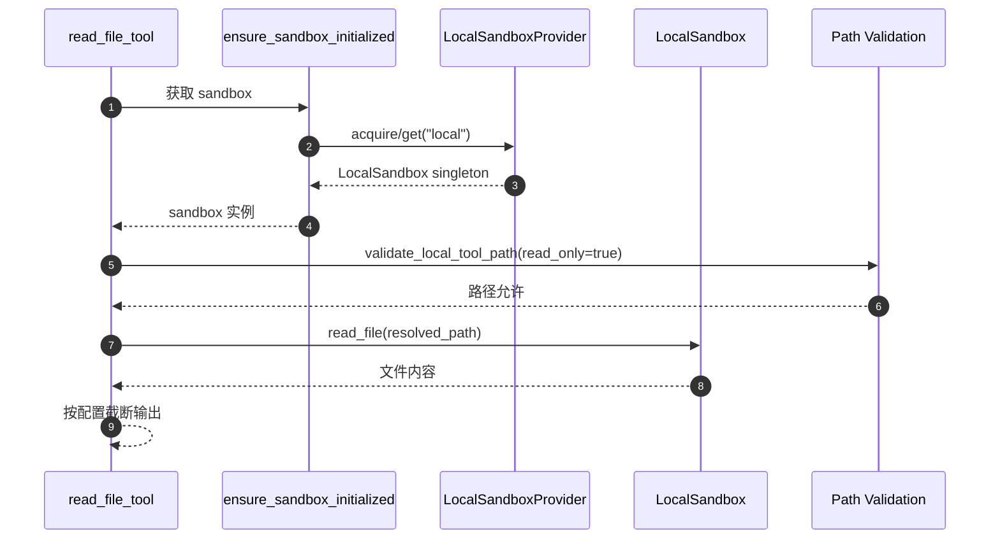
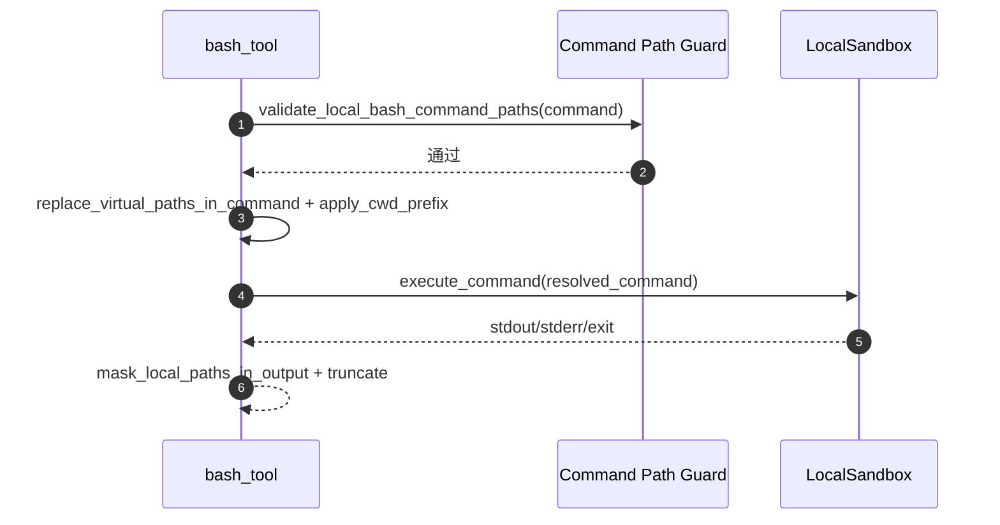

# Sandbox 体系设计与 Local 实现详解

本文档整理 DeerFlow 当前 sandbox 体系的整体设计、模块职责、核心执行链路，并重点展开 LocalSandboxProvider 的定位与实现细节。

## 1. 设计目标

- 抽象统一的执行环境接口，屏蔽本地与容器后端差异。
- 将 sandbox 生命周期纳入 agent runtime，支持按线程复用。
- 对文件与命令访问施加安全约束，减少越界和敏感路径泄露。
- 在本地开发与生产隔离场景之间提供可配置切换能力。

## 2. 架构分层

Sandbox 体系可分为五层：

1. **抽象层**：`Sandbox` 抽象类定义能力面（execute/read/write/list/glob/grep/update）。
2. **Provider 层**：`SandboxProvider` 抽象 + `get_sandbox_provider()` 单例工厂。
3. **运行时层**：`SandboxMiddleware` + `ensure_sandbox_initialized()` 完成生命周期衔接。
4. **工具层**：`bash/ls/glob/grep/read_file/write_file/str_replace` 等统一走 sandbox 实例。
5. **安全层**：路径校验、路径映射、输出脱敏、host bash 显式开关。

## 3. 核心抽象

## 3.1 Sandbox 抽象接口

`Sandbox` 是统一执行契约，定义：

- `execute_command(command)`
- `read_file(path)`
- `list_dir(path, max_depth)`
- `write_file(path, content, append)`
- `glob(path, pattern, ...)`
- `grep(path, pattern, ...)`
- `update_file(path, content)`

这样工具层只依赖抽象，不依赖具体后端实现。

## 3.2 SandboxProvider 与单例工厂

`get_sandbox_provider()` 通过 `config.sandbox.use` 反射加载 provider，并缓存为单例。

- 支持 `reset_sandbox_provider()`（测试/切换）
- 支持 `shutdown_sandbox_provider()`（应用退出清理）

Provider 负责：

- `acquire(thread_id)`：获取 sandbox id
- `get(sandbox_id)`：拿到 sandbox 实例
- `release(sandbox_id)`：释放 sandbox（由 provider 决定是否真正销毁）

## 4. 运行时生命周期

## 4.1 中间件衔接

`SandboxMiddleware` 挂在 runtime middleware 链中：

- `lazy_init=True`：默认延迟到第一次工具调用再分配 sandbox。
- `lazy_init=False`：在 `before_agent` 即预分配。

## 4.2 首次工具调用初始化

工具调用时执行 `ensure_sandbox_initialized(runtime)`：

1. 若 state 中已有 sandbox_id 且 provider 可取回实例，直接复用。
2. 否则从 runtime context/config 获取 `thread_id`。
3. 调 provider `acquire(thread_id)` 获取 sandbox_id。
4. 回写 `runtime.state["sandbox"]`。
5. 通过 provider `get()` 返回 sandbox 实例。

这使 sandbox 生命周期与线程上下文绑定，并避免每次调用重复创建。

## 5. Local 的定位

Local 模式（`deerflow.sandbox.local:LocalSandboxProvider`）定位是：

- **面向本地开发与调试的轻量执行层**；
- 通过路径映射在宿主机执行命令与文件操作；
- **不是强隔离安全边界**。

因此系统默认：

- `allow_host_bash: false`；
- 不建议在不可信环境开启 host bash；
- 生产场景建议使用 AioSandboxProvider（容器隔离后端）。

## 6. LocalSandboxProvider 设计

## 6.1 单例复用模型

Local provider 内部维护 `_singleton: LocalSandbox | None`：

- `acquire()` 首次创建 `LocalSandbox("local")`；
- 后续复用同一个本地 sandbox；
- `release()` 为 no-op（不销毁）。

这种设计减少本地反复初始化开销，适合开发场景。

## 6.2 路径映射装配

`_setup_path_mappings()` 会构建 container->host 的映射：

- skills 路径映射（固定只读）
- custom mounts（来自 `config.sandbox.mounts`）

校验规则：

- host_path 必须绝对路径且存在
- container_path 必须绝对路径
- 禁止与保留前缀冲突（`/mnt/user-data`、`/mnt/acp-workspace`、skills 前缀）

## 7. LocalSandbox 核心实现

## 7.1 路径解析与反解析

LocalSandbox 同时做双向映射：

- `_resolve_path()`：container 路径 -> host 路径
- `_reverse_resolve_path()`：host 路径 -> container 路径
- `_reverse_resolve_paths_in_output()`：批量替换输出中的宿主路径

作用：

- 工具调用可使用统一虚拟路径；
- 返回给模型/用户时不暴露宿主机目录结构。

## 7.2 命令执行

`execute_command()` 核心步骤：

1. `_resolve_paths_in_command()` 将命令中 container 路径替换为 host 路径。
2. 自动选择可用 shell（zsh/bash/sh，Windows 下 pwsh/cmd fallback）。
3. `subprocess.run(...)` 执行，拼接 stdout/stderr/exit code。
4. 输出经过 `_reverse_resolve_paths_in_output()` 再返回。

## 7.3 文件与搜索能力

- `read_file` / `write_file` / `update_file`
- `list_dir`（树形列举）
- `glob`（模式匹配）
- `grep`（内容检索）

写入相关会检查只读映射，命中后抛 `EROFS`。

## 8. 工具层中的 Local 安全网关

工具层在 Local 模式会额外走安全路径：

## 8.1 路径访问校验

`validate_local_tool_path(path, thread_data, read_only)`：

- 允许 `/mnt/user-data/*`
- skills 与 acp-workspace 仅允许读（`read_only=True`）
- custom mount 按 mount.read_only 生效
- 一律拒绝 `..` 路径穿越

## 8.2 用户数据目录边界

`_resolve_and_validate_user_data_path()`：

1. 虚拟路径替换为真实路径；
2. `Path.resolve()` 后验证必须位于 `workspace/uploads/outputs` 根内；
3. 否则拒绝。

## 8.3 bash 特殊限制

`bash_tool` 在 Local 模式默认拒绝（allow_host_bash=false）。

若显式允许 host bash：

1. `validate_local_bash_command_paths()` 校验命令内绝对路径；
2. 禁止 `file://` URL；
3. 仅放行 user-data/skills/acp/custom mounts 与少量系统路径前缀；
4. `replace_virtual_paths_in_command()` 执行路径替换；
5. `_apply_cwd_prefix()` 自动锚定到线程 workspace；
6. 执行后输出脱敏并截断。

## 8.4 并发写保护

`write_file` 与 `str_replace` 使用 `get_file_operation_lock(sandbox, path)`：

- 锁粒度为 `(sandbox_id, path)`；
- 避免并发写覆盖与读写竞态。

## 9. 典型调用时序

### 9.1 Local 模式 read_file

### 9.2 Local 模式 bash（allow_host_bash=true）

## 10. Local 与 Aio 的关系

- **LocalSandboxProvider**
  - 快速、本地、低成本、弱隔离。
- **AioSandboxProvider**
  - 容器/远程后端、支持副本与空闲回收、适合隔离要求更高的环境。

两者通过同一 `Sandbox/SandboxProvider` 抽象对齐，上层工具无需改动。

## 11. 设计总结

Sandbox 体系通过“抽象统一 + 运行时懒初始化 + 工具层安全网关 + 路径脱敏”实现了可扩展且可治理的执行基础设施。

其中 Local 模式重点在开发效率，安全上采用“默认收紧 + 显式放权 + 多重校验”策略；当需要更强隔离时，可平滑切换到 Aio 模式而不改变上层工具接口。
