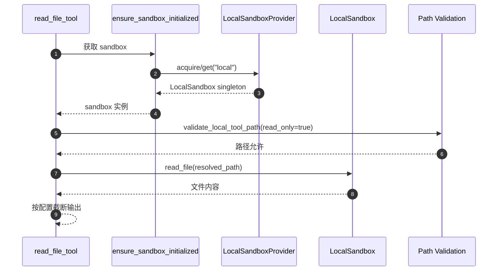
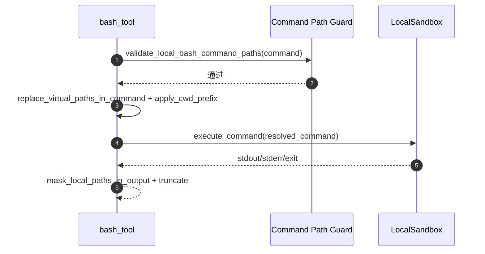

# Sandbox 体系设计与 Local 实现详解

本文档整理 DeerFlow 当前 sandbox 体系的整体设计、模块职责、核心执行链路，并重点展开 LocalSandboxProvider 的定位与实现细节。

## 1. 设计目标

- 抽象统一的执行环境接口，屏蔽本地与容器后端差异。
- 将 sandbox 生命周期纳入 agent runtime，支持按线程复用。
- 对文件与命令访问施加安全约束，减少越界和敏感路径泄露。
- 在本地开发与生产隔离场景之间提供可配置切换能力。

## 2. 架构分层

Sandbox 体系可分为五层：

1. **抽象层**：`Sandbox` 抽象类定义能力面（execute/read/write/list/glob/grep/update）。
2. **Provider 层**：`SandboxProvider` 抽象 + `get_sandbox_provider()` 单例工厂。
3. **运行时层**：`SandboxMiddleware` + `ensure_sandbox_initialized()` 完成生命周期衔接。
4. **工具层**：`bash/ls/glob/grep/read_file/write_file/str_replace` 等统一走 sandbox 实例。
5. **安全层**：路径校验、路径映射、输出脱敏、host bash 显式开关。

## 2.1 sandbox 目录文件职责速览

为便于快速定位，这里按“模块文件 -> 职责/定位”列出 sandbox 目录下每个代码文件的功能。

### 2.1.1 抽象与装配

- `sandbox.py`
  - 定义 `Sandbox` 抽象接口（execute/read/write/list/glob/grep/update）。
  - 工具层与上层业务只依赖这个接口，不依赖具体后端实现。
- `sandbox_provider.py`
  - 定义 `SandboxProvider` 抽象（acquire/get/release）。
  - `get_sandbox_provider()` 通过 `config.sandbox.use` 反射加载 provider，并缓存为单例；提供 reset/shutdown/set 以支持测试注入与切换。
- `__init__.py`
  - 对外导出 `Sandbox` / `SandboxProvider` / `get_sandbox_provider`。

### 2.1.2 运行时生命周期

- `middleware.py`
  - 将 sandbox 生命周期接入 agent runtime middleware。
  - `lazy_init=True`（默认）时，延迟到首次工具调用才分配 sandbox；`lazy_init=False` 时在 `before_agent` 就预分配。
  - `after_agent` 中调用 provider.release 释放 sandbox（Local provider 的 release 为 no-op；容器 provider 通常会回收/销毁）。

### 2.1.3 工具层（面向 Agent 的能力入口）

- `tools.py`
  - 定义工具：`bash` / `ls` / `glob` / `grep` / `read_file` / `write_file` / `str_replace`，统一使用 `Sandbox` 实例完成操作。
  - 在 Local 模式下承担“安全网关 + 路径映射 + 输出脱敏 + 并发写保护”等关键逻辑：
    - 虚拟路径解析（/mnt/user-data、/mnt/skills、/mnt/acp-workspace、custom mounts）
    - 访问控制（允许路径家族、read-only 限制、路径穿越检测）
    - bash 命令中的绝对路径扫描与限制
    - 输出脱敏（将 host 真实路径 mask 回虚拟路径）
    - 写入操作加锁，避免并发写覆盖

### 2.1.4 安全与错误

- `security.py`
  - 判断当前是否使用 LocalSandboxProvider，并决定是否允许 host bash（默认不允许，需显式 `sandbox.allow_host_bash: true`）。
- `exceptions.py`
  - sandbox 相关异常定义（NotFound/Runtime/Command/File/Permission 等），用于工具层返回结构化错误信息。
- `file_operation_lock.py`
  - 按 `(sandbox_id, path)` 维度提供互斥锁，工具层写文件/替换字符串时使用，避免并发竞态。

### 2.1.5 本地实现（Local）

- `local/local_sandbox_provider.py`
  - Local provider：装配路径映射（skills + config 中 mounts），并以 singleton 形式持有 `LocalSandbox("local")`。
- `local/local_sandbox.py`
  - LocalSandbox：在宿主机执行命令、读写文件，并实现 container_path ↔ host_path 的双向映射与输出反向映射（隐藏宿主机目录结构）。
- `local/list_dir.py`
  - 本地目录树遍历实现（带忽略规则与最大深度）。
- `local/__init__.py`
  - 导出 LocalSandboxProvider。

### 2.1.6 搜索能力

- `search.py`
  - 纯 Python 的 `glob`/`grep` 实现：内置忽略目录规则，跳过二进制/大文件，并限制最大返回数量，避免性能与安全问题（例如 minified/无换行文件导致的正则灾难）。

## 3. 核心抽象

## 3.1 Sandbox 抽象接口

`Sandbox` 是统一执行契约，定义：

- `execute_command(command)`
- `read_file(path)`
- `list_dir(path, max_depth)`
- `write_file(path, content, append)`
- `glob(path, pattern, ...)`
- `grep(path, pattern, ...)`
- `update_file(path, content)`

这样工具层只依赖抽象，不依赖具体后端实现。

## 3.2 SandboxProvider 与单例工厂

`get_sandbox_provider()` 通过 `config.sandbox.use` 反射加载 provider，并缓存为单例。

- 支持 `reset_sandbox_provider()`（测试/切换）
- 支持 `shutdown_sandbox_provider()`（应用退出清理）

Provider 负责：

- `acquire(thread_id)`：获取 sandbox id
- `get(sandbox_id)`：拿到 sandbox 实例
- `release(sandbox_id)`：释放 sandbox（由 provider 决定是否真正销毁）

## 4. 运行时生命周期

## 4.1 中间件衔接

`SandboxMiddleware` 挂在 runtime middleware 链中：

- `lazy_init=True`：默认延迟到第一次工具调用再分配 sandbox。
- `lazy_init=False`：在 `before_agent` 即预分配。

## 4.2 首次工具调用初始化

工具调用时执行 `ensure_sandbox_initialized(runtime)`：

1. 若 state 中已有 sandbox_id 且 provider 可取回实例，直接复用。
2. 否则从 runtime context/config 获取 `thread_id`。
3. 调 provider `acquire(thread_id)` 获取 sandbox_id。
4. 回写 `runtime.state["sandbox"]`。
5. 通过 provider `get()` 返回 sandbox 实例。

这使 sandbox 生命周期与线程上下文绑定，并避免每次调用重复创建。

## 5. Local 的定位

Local 模式（`deerflow.sandbox.local:LocalSandboxProvider`）定位是：

- **面向本地开发与调试的轻量执行层**；
- 通过路径映射在宿主机执行命令与文件操作；
- **不是强隔离安全边界**。

因此系统默认：

- `allow_host_bash: false`；
- 不建议在不可信环境开启 host bash；
- 生产场景建议使用 AioSandboxProvider（容器隔离后端）。

## 6. LocalSandboxProvider 设计

## 6.1 单例复用模型

Local provider 内部维护 `_singleton: LocalSandbox | None`：

- `acquire()` 首次创建 `LocalSandbox("local")`；
- 后续复用同一个本地 sandbox；
- `release()` 为 no-op（不销毁）。

这种设计减少本地反复初始化开销，适合开发场景。

## 6.2 路径映射装配

`_setup_path_mappings()` 会构建 container->host 的映射：

- skills 路径映射（固定只读）
- custom mounts（来自 `config.sandbox.mounts`）

校验规则：

- host_path 必须绝对路径且存在
- container_path 必须绝对路径
- 禁止与保留前缀冲突（`/mnt/user-data`、`/mnt/acp-workspace`、skills 前缀）

## 7. LocalSandbox 核心实现

## 7.1 路径解析与反解析

LocalSandbox 同时做双向映射：

- `_resolve_path()`：container 路径 -> host 路径
- `_reverse_resolve_path()`：host 路径 -> container 路径
- `_reverse_resolve_paths_in_output()`：批量替换输出中的宿主路径

作用：

- 工具调用可使用统一虚拟路径；
- 返回给模型/用户时不暴露宿主机目录结构。

## 7.2 命令执行

`execute_command()` 核心步骤：

1. `_resolve_paths_in_command()` 将命令中 container 路径替换为 host 路径。
2. 自动选择可用 shell（zsh/bash/sh，Windows 下 pwsh/cmd fallback）。
3. `subprocess.run(...)` 执行，拼接 stdout/stderr/exit code。
4. 输出经过 `_reverse_resolve_paths_in_output()` 再返回。

## 7.3 文件与搜索能力

- `read_file` / `write_file` / `update_file`
- `list_dir`（树形列举）
- `glob`（模式匹配）
- `grep`（内容检索）

写入相关会检查只读映射，命中后抛 `EROFS`。

## 8. 工具层中的 Local 安全网关

工具层在 Local 模式会额外走安全路径：

## 8.1 路径访问校验

`validate_local_tool_path(path, thread_data, read_only)`：

- 允许 `/mnt/user-data/*`
- skills 与 acp-workspace 仅允许读（`read_only=True`）
- custom mount 按 mount.read_only 生效
- 一律拒绝 `..` 路径穿越

## 8.2 用户数据目录边界

`_resolve_and_validate_user_data_path()`：

1. 虚拟路径替换为真实路径；
2. `Path.resolve()` 后验证必须位于 `workspace/uploads/outputs` 根内；
3. 否则拒绝。

## 8.3 bash 特殊限制

`bash_tool` 在 Local 模式默认拒绝（allow_host_bash=false）。

若显式允许 host bash：

1. `validate_local_bash_command_paths()` 校验命令内绝对路径；
2. 禁止 `file://` URL；
3. 仅放行 user-data/skills/acp/custom mounts 与少量系统路径前缀；
4. `replace_virtual_paths_in_command()` 执行路径替换；
5. `_apply_cwd_prefix()` 自动锚定到线程 workspace；
6. 执行后输出脱敏并截断。

## 8.4 并发写保护

`write_file` 与 `str_replace` 使用 `get_file_operation_lock(sandbox, path)`：

- 锁粒度为 `(sandbox_id, path)`；
- 避免并发写覆盖与读写竞态。

## 8.5 虚拟路径家族与访问控制（总览）

Local 模式下工具层首先将路径视为“虚拟路径（container 视角）”，并根据路径家族做访问控制与解析。默认允许的路径家族是：

- `/mnt/user-data/*`：线程隔离的用户数据（workspace/uploads/outputs），允许读写。
- `/mnt/skills/*`：skills 目录，默认只读（仅 `read_only=True` 的工具可访问）。
- `/mnt/acp-workspace/*`：ACP 工作区，默认只读（仅 `read_only=True` 的工具可访问）。
- `config.sandbox.mounts` 中配置的自定义 mount `container_path/*`：是否允许写取决于 mount.read_only。

此外，所有路径都会拒绝包含 `..` 的路径段，以避免目录穿越。

## 8.6 `/mnt/user-data` 的映射与越界防护

### 8.6.1 映射目标

工具层希望 agent 始终使用稳定的虚拟路径：

- `/mnt/user-data/workspace/*`
- `/mnt/user-data/uploads/*`
- `/mnt/user-data/outputs/*`

Local 模式下这些虚拟路径需要映射到当前 thread 的实际 host 目录（由 `thread_data` 提供）。

### 8.6.2 映射方式（虚拟 -> 实际）

- `replace_virtual_path(path, thread_data)` 会根据 `thread_data.workspace_path/uploads_path/outputs_path` 做“最长前缀优先”的替换，确保子路径拼接保持路径风格一致。
- `_resolve_and_validate_user_data_path(path, thread_data)` 在替换后还会执行：
  - `Path.resolve()` 规范化；
  - `_validate_resolved_user_data_path(...)` 校验最终路径必须落在 workspace/uploads/outputs 的任一根目录之内，否则拒绝访问（防止通过符号链接/路径技巧越界）。

## 8.7 `/mnt/skills` 与 `/mnt/acp-workspace` 的解析与只读限制

### 8.7.1 `/mnt/skills`

- `_get_skills_container_path()` 从配置读取 skills 虚拟前缀（默认 `/mnt/skills`），并在成功读取后缓存。
- `_resolve_skills_path(path)` 将虚拟 skills 路径解析到 host 的 skills 目录。
- `validate_local_tool_path(..., read_only=True)` 才允许访问 skills；写入类工具会直接拒绝对 skills 的写操作。

### 8.7.2 `/mnt/acp-workspace`

- `_resolve_acp_workspace_path(path, thread_id)` 将虚拟 ACP workspace 路径解析到 host 目录：
  - 优先按 thread_id 解析到 `{base_dir}/threads/{thread_id}/acp-workspace/`；
  - thread_id 不可用时回退到全局 `{base_dir}/acp-workspace/`；
  - 并包含路径穿越检测，确保解析后的路径不逃逸出 ACP workspace 根目录。
- 同样只允许在 `read_only=True` 的工具中访问。

## 8.8 Custom mounts（自定义挂载）路径映射与读写策略

### 8.8.1 映射装配（Provider 层）

LocalSandboxProvider 在启动时会组装 PathMapping：

- skills 映射：固定只读。
- `config.sandbox.mounts`：将 `host_path`（宿主机真实目录）映射到 `container_path`（agent 看到的虚拟目录）。

装配时会做关键校验：

- host_path/container_path 必须是绝对路径；
- host_path 必须存在才会加入；
- container_path 不能与保留前缀冲突（`/mnt/user-data`、`/mnt/acp-workspace`、skills 前缀）。

### 8.8.2 映射执行（LocalSandbox 层）

LocalSandbox 在执行命令/文件操作时做双向映射：

- `_resolve_path(container_path)`：container -> host（最长前缀优先）。
- `_reverse_resolve_path(host_path)`：host -> container（最长本地路径优先）。
- `_reverse_resolve_paths_in_output(output)`：批量替换输出中的 host 路径为 container 路径，避免泄露宿主机目录结构。

### 8.8.3 写入限制

LocalSandbox 对 `write_file` / `update_file` 会检查解析后的 host 路径是否位于 read_only mount 下；若是则抛出 `EROFS`（只读文件系统）错误。

## 8.9 Local 模式 bash：绝对路径扫描与限制

Local 模式的 bash 默认禁用（因为 host bash 不是强隔离的安全边界）。当显式开启后，仍会执行“命令内绝对路径扫描”：

- 禁止 `file://...` URL（避免绕过绝对路径正则扫描直接读本地文件）。
- 允许的绝对路径：
  - `/mnt/user-data/*`、`/mnt/skills/*`、`/mnt/acp-workspace/*`、custom mounts container_path；
  - 少量系统路径前缀（如 `/bin/`、`/usr/bin/`、`/dev/`）用于可执行文件/设备引用；
  - MCP filesystem server 配置中显式允许的 host 路径（用于受控开放额外目录）。

## 8.10 输出脱敏：避免泄露宿主机路径

Local 模式下，错误信息、命令输出、glob/grep 结果都可能包含 host 绝对路径。系统通过两处机制进行脱敏：

- 工具层 `mask_local_paths_in_output(output, thread_data)`：将 user-data/skills/acp-workspace 的 host 路径 mask 回虚拟路径。
- LocalSandbox `_reverse_resolve_paths_in_output(output)`：将 custom mounts 的 host 路径反向映射回 container_path。

此外 `_sanitize_error(...)` 会在 local 模式下对异常信息做同样的脱敏处理，避免错误字符串泄露 host 目录结构。

## 8.11 “命令字符串中的路径替换”链路（bash 场景）

bash 在 Local 模式中，路径替换分两段完成：

1. 工具层 `replace_virtual_paths_in_command(command, thread_data)`：
   - 将 `/mnt/user-data`、`/mnt/skills`、`/mnt/acp-workspace` 替换为对应的 host 实际路径。
2. LocalSandbox `_resolve_paths_in_command(command)`：
   - 将 custom mounts 的 `container_path` 替换为 `host_path`。

随后工具层会对命令追加 `cd <workspace> &&` 前缀，使相对路径默认锚定到线程 workspace（减少“命令在哪个 cwd 执行”的不确定性）。

## 9. 典型调用时序

### 9.1 Local 模式 read_file

### 9.2 Local 模式 bash（allow_host_bash=true）

## 10. Local 与 Aio 的关系

- **LocalSandboxProvider**
  - 快速、本地、低成本、弱隔离。
- **AioSandboxProvider**
  - 容器/远程后端、支持副本与空闲回收、适合隔离要求更高的环境。

两者通过同一 `Sandbox/SandboxProvider` 抽象对齐，上层工具无需改动。

## 11. 设计总结

Sandbox 体系通过“抽象统一 + 运行时懒初始化 + 工具层安全网关 + 路径脱敏”实现了可扩展且可治理的执行基础设施。

其中 Local 模式重点在开发效率，安全上采用“默认收紧 + 显式放权 + 多重校验”策略；当需要更强隔离时，可平滑切换到 Aio 模式而不改变上层工具接口。

## 12. 现状边界问题分析与改造建议（不改代码）

本节对当前实现做“边界与优雅性”视角的复盘：哪些地方职责交叉、语义不一致、规则不统一，以及推荐的改造方向（以架构与分层设计为主，不涉及具体代码改动）。

### 12.1 主要问题画像

可以用一句话概括：当前 sandbox 的名义分层（抽象/Provider/运行时/工具/安全）是成立的，但“路径体系（Path）”与“生命周期（Lifecycle）”这两条主线缺少单一权威模块，导致规则散落、重复实现与行为不一致。

典型表现包括：

- 同一类虚拟路径（尤其 custom mounts）在不同工具里解析策略不一致。
- 生命周期语义在中间件、工具层与 provider 之间存在重复表达与漂移风险。
- LocalSandbox 与工具层同时做路径替换/输出脱敏，形成双重权威，难以证明“输出不泄露 host 路径”。
- “local vs 非 local”差异通过大量 if/else 散布在工具层，抽象泄漏，后续扩展成本高。

### 12.2 具体实例分析

#### 12.2.1 custom mounts 在不同工具上的一致性风险

目标语义是：当配置了 `config.sandbox.mounts` 后，`container_path/*` 应该作为“允许访问的虚拟路径家族”在所有工具中一致可用。

当前实现对 custom mounts 的处理路径分散：

- `read_file` / `ls` / `write_file` / `str_replace`：
  - 工具层只做允许性校验（包含 custom mount 家族），然后把路径交给 LocalSandbox 解析（`_resolve_path`）。
- `glob` / `grep`：
  - 工具层会先调用 `_resolve_local_read_path(...)` 进行“本地读取路径解析”，其策略聚焦在 `/mnt/user-data`、skills、ACP workspace，custom mounts 的解析责任并未同样清晰地归属到 LocalSandbox。

这类差异会导致一个很难解释的结果：同样的 `container_path`，在 `ls/read_file` 下可用，但在 `glob/grep` 下可能报错或表现不同，破坏了“虚拟路径家族”的一致性契约。

#### 12.2.2 生命周期语义：注释/设计意图与实现点分散

设计层面希望 sandbox “按 thread 复用、避免每次调用重建”，但实现上：

- 中间件（`after_agent`）显式调用 `provider.release(...)`；
- 工具层又维护 `runtime.context["sandbox_id"]` 以便释放；
- provider 内部对 release 的语义不统一（Local 是 no-op，容器 provider 可能是真释放/回收）。

当 release 的语义缺少集中治理时，容易出现：

- 文档/注释期望“turn 内或 thread 内复用”，但某些 provider 的 release 实际会销毁，导致每 turn 重建。
- 行为依赖 provider 的隐式约定，而不是系统层面的明确策略。

#### 12.2.3 路径替换与输出脱敏“双重权威”

Local 模式下“host 路径 ↔ 虚拟路径”的来回转换存在两套实现：

- 工具层：
  - 将 `/mnt/user-data`、skills、ACP workspace 的虚拟路径解析到 host；
  - 再对输出/错误字符串做 mask，避免泄露 host 路径。
- LocalSandbox：
  - 在命令字符串中对 container_path（尤其 custom mounts）做解析；
  - 在命令输出中做反向替换（`_reverse_resolve_paths_in_output`）。

双重权威的问题不是“有重复代码”这么简单，而是会让系统缺少可证明的安全与可预测性边界：

- 到底哪个阶段对输出负责完全脱敏？
- 是否存在某些路径在工具层未覆盖、LocalSandbox 也未覆盖的泄露窗口？
- 两套正则替换规则若不一致，是否会出现误替换或漏替换？

#### 12.2.4 抽象泄漏：工具层对 Local 细节知道太多

`Sandbox` 抽象层的目标是屏蔽后端差异，但工具层为了支持 Local 模式在实现上显式分叉出大量路径校验、解析、替换与脱敏逻辑。

结果是：新增一种 sandbox 后端、或新增一种虚拟路径家族时，需要改动的点会扩散到多个工具函数，难以演进。

### 12.3 改造目标（理想边界）

建议把“边界清晰”具体化为以下目标契约：

- 单一权威：路径解析/反解析/脱敏应有明确归属（一个模块说了算）。
- 一致性：同一虚拟路径家族在 read/ls/glob/grep/bash 上的解析规则与权限语义一致。
- 生命周期可解释：acquire/get/release 的触发点与复用粒度（turn/thread/shutdown）明确且与 provider 解耦。
- 抽象不泄漏：工具层不需要显式区分 local vs 非 local，策略由 provider/policy 注入。
- 安全边界可声明：对“允许访问的路径集合、越界防护策略、bash 允许集合、输出脱敏覆盖范围”能给出清晰声明并可测试。

### 12.4 改造方案（架构分层，不涉及具体代码改动）

#### 12.4.1 引入 PathPolicy（路径策略单一权威）

将以下能力从工具层分散逻辑与 LocalSandbox 的部分逻辑中抽离，收拢为“路径策略”模块（概念上）：

- 虚拟路径家族识别：user-data / skills / acp-workspace / custom mounts。
- 权限判定：读写允许性、read-only enforcement、路径穿越拒绝。
- 解析：虚拟 -> host（并包含越界防护）。
- 反解析与脱敏：host -> 虚拟（覆盖错误字符串/命令输出/搜索结果）。
- 命令字符串重写：将命令中的虚拟路径替换为 host 路径（可与 bash 重写合并）。

工具层的理想形态是：只做“调用策略模块 + 调用 sandbox 接口”，不再内置 local-specific 分支。

LocalSandbox 的理想形态是：只做执行与 IO（接受已解析的 host path 或者接受结构化参数），不再承担路径 regex 替换与输出脱敏。

#### 12.4.2 引入 SandboxLease（生命周期策略单一权威）

把“何时 acquire、何时 release、复用粒度是什么”收敛到租约/池化概念（概念上）：

- `SandboxLease` 绑定到 thread（或 session），由系统层管理。
- 中间件只负责注入 lease（或 lease id），并在明确的生命周期点结束 lease。
- provider 只负责“如何创建/回收某个 sandbox 实例”，不承担“何时释放”的业务策略。

这样可以避免“文档说复用，但实现释放点分散”的语义漂移，并让容器 provider 的释放回收策略在系统层可控。

#### 12.4.3 bash 责任解耦：Policy / Rewrite / Execute / Mask

将 bash 链路拆为四段概念组件：

- BashPolicy：命令允许性校验（绝对路径扫描、file:// 禁止、系统路径白名单、MCP allowed paths）。
- CommandRewriter：路径替换与 cwd 锚定（虚拟 -> host、`cd workspace &&` 注入）。
- Executor：执行与 stdout/stderr/exit code 采集。
- OutputMasker：输出脱敏与截断。

解耦的价值在于：每段都能独立被说明与测试，且更容易把同一套策略复用到非 Local 的后端。

### 12.5 落地路线图（仅规划）

如果后续要推进重构，建议按“风险最小、收益最大”的顺序组织：

1. 先把“路径家族一致性”作为第一目标：custom mounts 在所有工具中的解析/权限语义一致。
2. 再收敛“输出脱敏单一权威”：明确由 PathPolicy（或后端）统一负责，避免双重替换。
3. 然后收敛“生命周期策略”：统一 release 语义，明确 turn/thread/shutdown 的边界。
4. 最后清理工具层的 local 分支：把策略下沉，工具层回到薄封装。

以上方案可以先作为架构设计与评审文本落地，在不改代码的前提下也能帮助团队对齐“什么是优雅与边界清晰”，并为后续重构提供验收标准。
