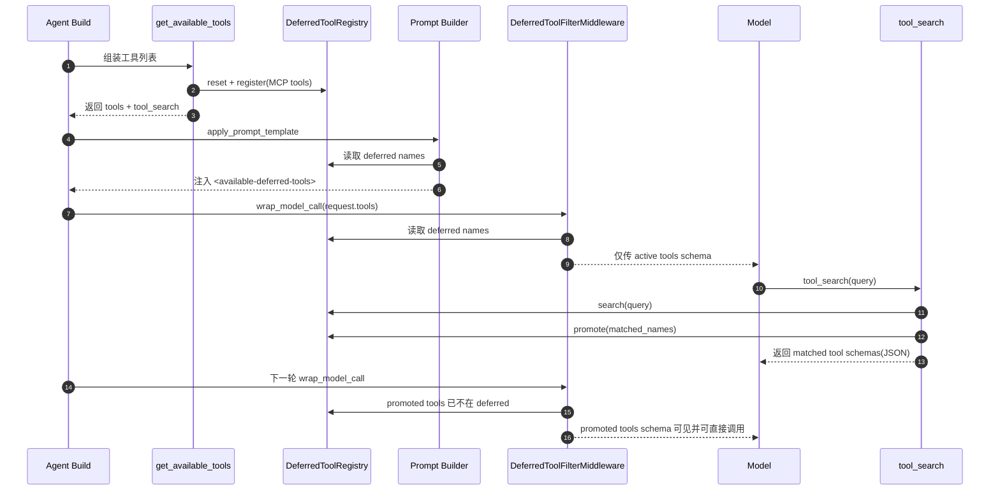
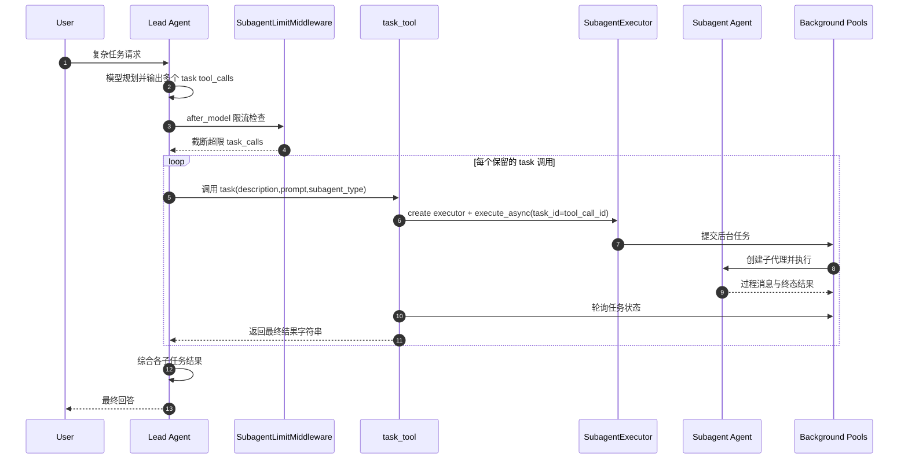
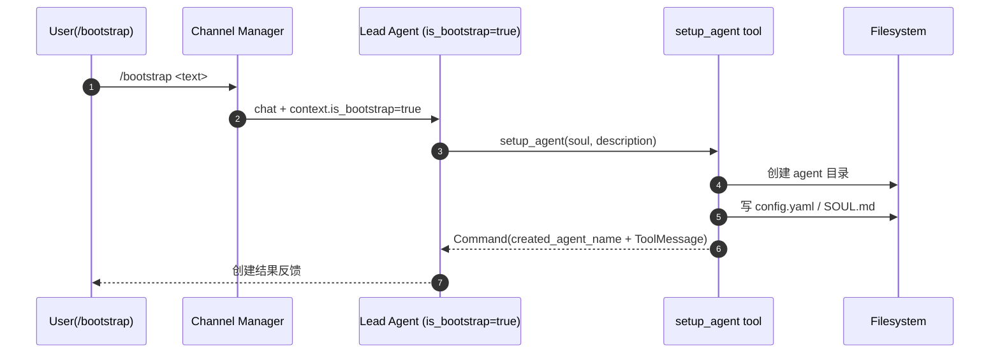

# Tool 与 Subagent 体系设计

本文档整理 DeerFlow 当前工具体系（tool system）与 subagent 体系的整体设计、模块职责与核心执行链路。

## 1. 设计目标

- 将工具能力统一抽象为可组合、可治理、可扩展的执行面。
- 通过中间件与安全策略对工具调用进行风险控制与稳定性保障。
- 在复杂任务场景中引入 subagent 分治与并行，降低主代理上下文压力。
- 支持 bootstrap 模式下自定义 agent 的快速初始化（setup_agent）。

## 2. Tool 体系总览

## 2.1 工具来源分层

工具最终由 `get_available_tools(...)` 统一装配，来源分为四类：

1. **配置工具**（`config.yaml -> tools`）
   - 如 web/file/bash 工具，按 `ToolConfig.use` 反射加载。
2. **内置工具**（`deerflow/tools/builtins`）
   - 如 `present_files`、`ask_clarification`、`task`、`view_image`。
3. **MCP 工具**
   - 从启用的 MCP servers 动态加载并缓存。
4. **ACP 工具**
   - 若配置了 ACP agents，动态生成 `invoke_acp_agent` 工具。

## 2.2 装配策略

`deerflow/tools/tools.py` 的关键策略：

- 默认内置工具：`present_files`、`ask_clarification`。
- `subagent_enabled=True` 时才加入 `task`。
- 模型支持视觉时才加入 `view_image`。
- 本地 sandbox 默认不暴露 host bash（按安全策略过滤）。
- 开启 `tool_search` 时，MCP 工具延迟注入（deferred），并追加 `tool_search` 工具。

## 2.3 Deferred Tool Search 机制

当 `tool_search.enabled=true`：

- MCP 工具先登记到 `DeferredToolRegistry`，不直接注入完整 schema。
- `DeferredToolFilterMiddleware` 在模型调用前过滤 deferred 工具定义。
- 模型需要时调用 `tool_search(query)` 获取目标工具 schema。
- 被检索到的工具会被 `promote`，后续可直接调用。

该机制减少上下文膨胀，并提升大量工具时的选择稳定性。

### 2.3.1 触发条件与入口

- 触发开关：`config.yaml -> tool_search.enabled: true`。
- 配置模型：`ToolSearchConfig.enabled`。
- 运行入口：`get_available_tools(...)` 在加载 MCP 工具后执行 deferred 注册。

### 2.3.2 装配阶段详细流程

在 `get_available_tools(...)` 中：

1. 先 `reset_deferred_registry()`，避免上下文残留导致脏 registry。
2. 正常获取 MCP 工具集合（缓存层 `get_cached_mcp_tools()`）。
3. 若开启 `tool_search`：
   - 新建 `DeferredToolRegistry`；
   - 将 MCP 工具逐个 `register(tool)`；
   - `set_deferred_registry(registry)`；
   - 将 `tool_search` 工具加入 builtin tools。

结果是：

- ToolNode 仍持有完整工具对象（可执行能力不丢）；
- 模型侧初始不拿到 deferred 工具 schema（减少上下文负担）。

### 2.3.3 Prompt 注入与模型可见性

系统提示词中会注入 `<available-deferred-tools>` 区块，列出 deferred 工具名：

- 由 `get_deferred_tools_prompt_section()` 生成；
- 仅在 `tool_search.enabled` 且 registry 非空时注入；
- 内容只包含工具名，不包含参数 schema。

这让模型知道“有哪些潜在工具”，但必须先调用 `tool_search` 才能获得可调用定义。

### 2.3.4 中间件过滤机制

`DeferredToolFilterMiddleware` 在 `wrap_model_call` 阶段执行：

1. 从 `get_deferred_registry()` 读取 deferred 名称集合；
2. 从 `request.tools` 中排除同名工具；
3. 用 `request.override(tools=active_tools)` 继续调用。

因此：

- 过滤仅影响“模型绑定时可见 schema”；
- 不影响底层 ToolNode 对全部工具的路由执行能力。

### 2.3.5 tool_search 工具的检索与晋升

`tool_search(query)` 是 deferred 模式下的 schema 发现器：

- 支持三类查询：
  - `select:name1,name2`（精确选择）
  - `+keyword rest`（名称必含 keyword，再按 rest 评分）
  - 普通关键词/regex（匹配 name + description）
- 返回值：
  - 匹配工具的 OpenAI function schema JSON 列表（最多 `MAX_RESULTS=5`）。
- 关键动作：
  - 对命中的工具执行 `registry.promote(names)`；
  - 被 promote 后不再是 deferred，对后续模型调用可直接可见并可调用。

### 2.3.6 并发隔离设计

deferred registry 使用 `ContextVar`（而非模块级全局变量）：

- 每个请求上下文独立 registry；
- 异步并发请求互不污染；
- sync 工具经线程执行时也能继承当前上下文副本。

该设计避免了并发场景下“请求 A 把请求 B 的 deferred 工具误晋升/误重置”的问题。

### 2.3.7 与 MCP 缓存的协同

Deferred Tool Search 依赖 MCP 工具来源，而 MCP 本身有缓存与配置热更新：

- `get_cached_mcp_tools()` 会在配置文件 mtime 变化时判 stale 并重置缓存；
- 下一次 deferred 注册即基于最新 MCP 配置重建 registry。

这保证了通过 Gateway 更新 MCP 配置后，LangGraph 侧 deferred 工具视图也能收敛到最新状态。

### 2.3.8 端到端时序

## 2.4 工具执行治理

工具调用不是裸执行，关键治理链路包括：

- `SandboxAuditMiddleware`：bash 风险分级（block/warn/pass）。
- `ToolErrorHandlingMiddleware`：工具异常转 `ToolMessage(status=error)`。
- `ClarificationMiddleware`：拦截 `ask_clarification` 并中断等待用户。
- `SubagentLimitMiddleware`：约束单轮 `task` 并发数。

## 3. 内置工具设计

## 3.1 ask_clarification

- **定位**：信息不足/需求歧义/高风险操作时的澄清入口。
- **实现要点**：
  - 工具函数本身仅占位；
  - 真实行为由 `ClarificationMiddleware` 拦截并返回 `Command(goto=END)`。

## 3.2 present_files

- **定位**：向前端显式呈现输出文件（artifact）。
- **核心流程**：
  1. 归一化并校验文件路径。
  2. 仅允许当前线程 outputs 目录内文件。
  3. 返回 `Command(update={"artifacts": ..., "messages": ...})`。

## 3.3 view_image

- **定位**：读取图片并放入状态，供下一轮模型视觉理解。
- **核心流程**：
  1. 虚拟路径映射到线程实际路径。
  2. 校验文件存在、类型与扩展名。
  3. 读取并 base64 编码。
  4. 写入 `viewed_images`，并返回成功 ToolMessage。

配套 `ViewImageMiddleware` 会在后续 `before_model` 阶段注入图片消息块。

## 3.4 task

- **定位**：将复杂任务委派给子代理执行（分治/并行/隔离上下文）。
- **核心流程**：
  1. 校验 subagent 类型可用性。
  2. 读取并覆盖 subagent 配置（如 max_turns）。
  3. 继承父级上下文（sandbox/thread_data/thread_id/model/trace_id）。
  4. 创建 `SubagentExecutor` 并后台执行。
  5. 后端轮询任务状态并流式回传进展事件。
  6. 任务结束后返回最终结果给主代理。

## 3.5 tool_search

- **定位**：deferred 工具场景下的 schema 发现器。
- **核心流程**：
  1. query 匹配 deferred registry（支持 `select:`、`+keyword`、regex）。
  2. 返回匹配工具的完整 function schema JSON。
  3. 将匹配工具从 deferred 集合中 promote。

## 3.6 invoke_acp_agent（动态）

- **定位**：调用外部 ACP 兼容 agent。
- **核心流程**：
  1. 根据配置构建工具描述与可选 agent 列表。
  2. 启动 ACP 进程与 session。
  3. 注入 cwd、MCP servers、模型等会话参数。
  4. 收集流式文本响应并返回。

## 3.7 setup_agent（bootstrap）

- **定位**：初始化自定义 agent（写入 `config.yaml` 与 `SOUL.md`）。
- **核心流程**：
  1. 从 runtime 读取 `agent_name`。
  2. 创建 agent 目录并写入配置与 soul。
  3. 返回 `created_agent_name` 与 ToolMessage。
  4. 失败时回滚目录。

## 4. Subagent 体系设计

## 4.1 设计定位

Subagent 体系用于把复杂任务从主代理分离出去执行，核心价值：

- 隔离主会话上下文，降低污染与窗口压力；
- 支持并行任务编排；
- 通过独立超时与状态机提升可控性。

## 4.2 核心模块

1. `SubagentConfig`（配置模型）
   - 定义 `tools` allowlist、`disallowed_tools` denylist、`model`、`max_turns`、`timeout_seconds`。
2. `registry`
   - 管理内置 subagent（`general-purpose`、`bash`）。
   - 根据 sandbox 安全策略决定是否暴露 `bash` 子代理。
   - 支持 config.yaml 的 timeout override。
3. `SubagentExecutor`
   - 负责创建子代理、执行任务、维护状态机、管理后台任务池。

## 4.3 内置 Subagent

- **general-purpose**
  - 面向复杂多步任务，继承父工具（含 denylist）。
- **bash**
  - 面向命令执行场景，工具集收敛到 sandbox 相关工具。

二者默认都禁止 `task`，防止递归套娃调用。

## 4.4 执行状态机与后台池

`SubagentExecutor` 使用全局后台任务表与线程池：

- 状态：`PENDING -> RUNNING -> COMPLETED/FAILED/TIMED_OUT`
- 线程池：
  - scheduler pool：调度执行任务
  - execution pool：实际运行子代理执行逻辑（可 timeout）
- 支持任务结果查询与终态清理，避免长期内存累积。

## 5. SubagentLimitMiddleware 详细设计

## 5.1 功能定位

- 在主代理 `after_model` 阶段对 `task` 工具调用数量做硬约束。
- 防止模型单轮发起过多并行子代理导致资源拥塞。

## 5.2 核心机制

- 从最后一条 AIMessage 读取 `tool_calls`。
- 识别 `name == "task"` 的调用序列。
- 超过上限时仅保留前 N 个，丢弃剩余调用。
- 回写替换后的 AIMessage，进入后续工具执行阶段。

## 5.3 设计意义

- Prompt 约束属于软约束，middleware 才是最终强制执行面。
- 与 `task_tool` 形成“入口限流 + 后台调度”双层保护。

## 6. setup_agent 与 subagent 的关系

两者属于不同维度：

- `task/subagent`：执行复杂任务的运行时能力。
- `setup_agent`：创建新 agent 角色配置的元能力（bootstrap 初始化）。

它们共同构成“执行 + 扩展”的代理生态：

- 一个负责“把任务做完”；
- 一个负责“把新角色建起来”。

## 7. 端到端核心链路时序

## 8. bootstrap 初始化链路（setup_agent）

## 9. 小结

当前体系形成了完整闭环：

- **Tool 装配层**：多来源工具统一接入；
- **治理层**：中间件控制安全、稳定与并发；
- **执行层**：task + SubagentExecutor 支撑复杂任务分治；
- **扩展层**：setup_agent 支撑自定义 agent 初始化。

该设计在可扩展性、可治理性与复杂任务吞吐之间实现了较好的工程平衡。
